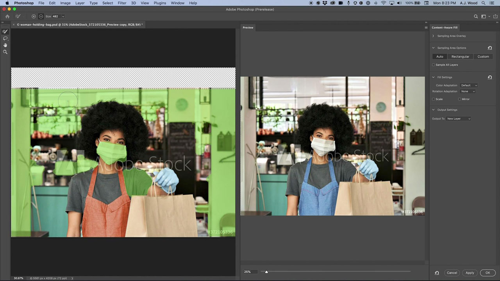

# Photoshop

Photoshopは、イメージングとグラフィックデザインに関する世界最高のソフトウェアであり、あらゆるデバイスのプロフェッショナルが無制限にクリエイティブに作業できます。 今では、誰でも想像しているものを、インスピレーションが湧くところならどこでも作り出すことができます。 考えさえすればPhotoshopで作れる。

## 製品のTutorialsを参照

<table style="table-layout:fixed">
<tr>
 <td>
   
    

   <a href="photoshop.md#tutorial1"><strong>キャンペーンに合わせて画像を編集する</strong></a>
    

    <em>Adobe Photoshopの強力な選択ツールとカラー編集ツールを使用して、企業のブランディングのニーズに合わせて画像を劇的に変化させます</em>
     
  </td>
  <td>
    
    

    <a href="photoshop.md#tutorial2"><strong>空を選択して置き換える</strong></a>
    

    <em>画像内の空を自動的に選択し、選択した空で置き換えて、選択範囲に合わせて画像のカラーを自動調整します</em>
     
  </td>
  <td>
    
    

     
  </td>
</tr>
</table>

## キャンペーン(5:45)に合わせて画像を編集 {#tutorial1}

>[!VIDEO](https://video.tv.adobe.com/v/326950?hidetitle=true)

**説明**
Adobe Photoshopの強力な選択ツールとカラー編集ツールを使用して、企業のブランディングのニーズに合わせて画像を劇的に変化させます。

このチュートリアルでは、次の内容について学習します。
* オブジェクト選択ツールを使用すると、項目をすばやく簡単に選択できます
* コンテンツに応じた塗りつぶしを使用すると、ソース画像内のサンプル領域をより詳細に制御して、ターゲット領域のクローン作成とパッチ適用を強化できます
* より良い結果を得るには、ブラシに異なるシェイプを使用します
* Adobe AIは人工知能を活用して日常的なタスクを処理

**発表者：**
シニアソリューションコンサルタント、A.J Wood氏（デジタルメディア）

## 空を選択して置き換え(2:16) {#tutorial2}

>[!VIDEO](https://video.tv.adobe.com/v/326953?hidetitle=true)

**説明**
画像内の空を自動的に選択し、選択した空に置き換えて、選択範囲に合わせて画像のカラーを自動調整します。

このチュートリアルでは、次の方法を学習します。
* 空を置き換えは、画像の空をすばやく入れ替えるワンクリックソリューションを提供します
* 「空を置き換え」では、出力がすべてのマスク、調整、画像とともにレイヤーグループとして保存され、さらに微調整が行われます

**発表者：**
シニアソリューションコンサルタント、A.J Wood氏（デジタルメディア）

**Photoshopリソース**

[ラーニングとサポート](https://helpx.adobe.com/jp/support/photoshop.html)は、追加のチュートリアル、[新機能](https://helpx.adobe.com/jp/photoshop/using/whats-new.html)、およびコミュニティフォーラムへのリンクのハブです。

**2020年10月リリース**

これらの機能の使用を開始しましょう（さらに多くの機能を使用できます）。 Creative Cloudのデスクトップアプリから最新のアップデートをダウンロードする方法を説明します。
