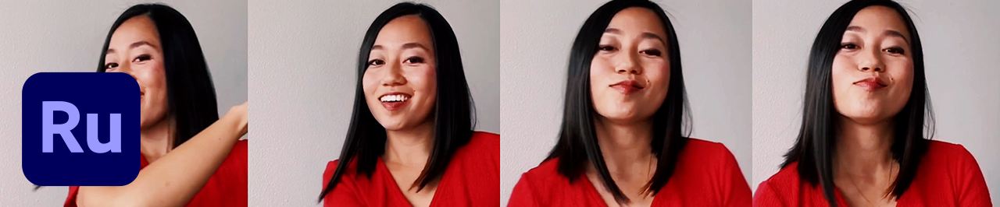

# [!DNL Rush]

Premiere [!DNL Rush] は、これまでになく簡単にオンラインコンテンツを作成および共有できる、最初のオールインワン、クロスデバイスのビデオ編集アプリです。 この統合されたデスクトップおよびモバイルソリューションは、プロジェクトおよび編集内容をクラウドに自動的に同期し、場所やデバイスを問わずに作業を行うことができます。

## 製品のTutorialsを参照

<table style="table-layout:fixed">
<tr>
 <td>
   
    

   <a href="rush.md#tutorial1"><strong>ソーシャルメディアビデオを作成</strong></a>
    

    <em>Adobe [!DNL Rush] どのデバイスでも作業でき、初心者でもプロ品質の出力が簡単にできます。</em>
     
  </td>
  <td>
    
    

     
  </td>
  <td>
    
    

     
  </td>
</tr>
</table>

## ソーシャルメディアビデオを作成(18:11) {#tutorial1}

>[!VIDEO](https://video.tv.adobe.com/v/326900?hidetitle=true)

**説明**
Adobeのビデオとオーディオを使用してストーリーを表現 [!DNL Stock]. Adobe [!DNL Rush] どのデバイスでも作業でき、初心者でもプロ品質の出力が簡単にできます。

このチュートリアルでは、次の方法を学習します。
* デスクトップ、タブレット、スマートフォンでビデオをシームレスに編集
* オートリフレームAIテクノロジー機能を使用して、水平、正方形、垂直のフォームファクターで被写体の中央を保ちます
* モーショングラフィックステンプレート(MoGRTS)を使用すると、プロフェッショナルな外観で簡単にカスタマイズできるタイトルとローワーサードを実現できます。
* 書き出しとソーシャルメディアチャネルへの直接の公開
* 開く [!DNL Rush] Adobe Premiere Proのプロジェクト

**提供元：**
A.J. Wood、ソリューション・コンサルタント（デジタル・メディア）

**[!DNL Rush]リソース**

[ラーニングとサポート](https://helpx.adobe.com/support/premiere-rush.html) は、追加のチュートリアルのハブです。 [新機能](https://helpx.adobe.com/premiere-rush/user-guide.html/premiere-rush/help/whats-new.ug.html)、およびコミュニティフォーラムへのリンク。

**2020年10月リリース**

これらの機能の使用を開始しましょう（さらに多くの機能を使用できます）。 Creative Cloudのデスクトップアプリから最新のアップデートをダウンロードする方法を説明します。
