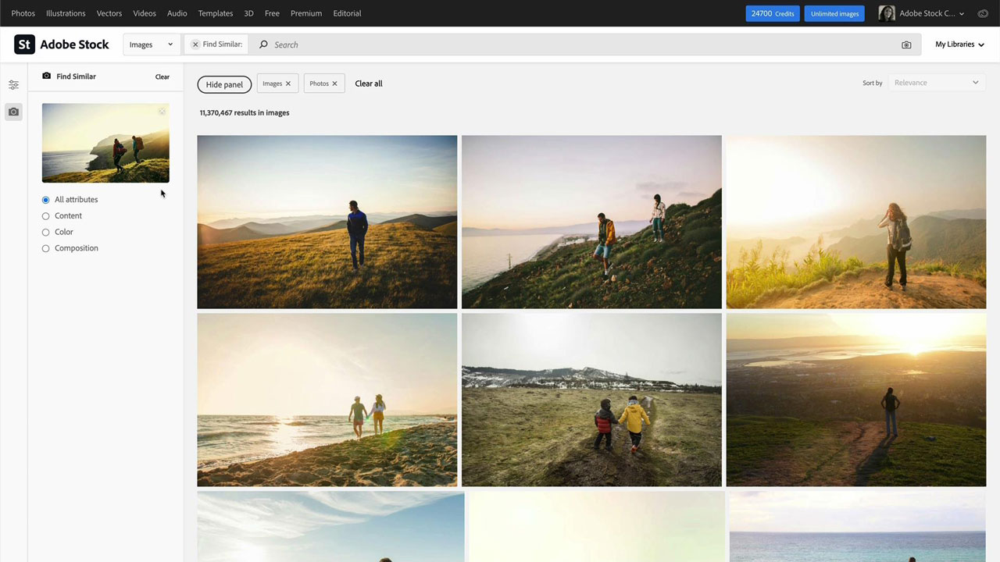

# [!DNL Stock]

クリエイターは、注目を集めて保持できる、視覚的に効果のある新しいコンテンツを迅速に提供するようプレッシャーを受けています。 Adobe [!DNL Stock]をエンタープライズ版にすると、クリエイティブチームは2億点以上の画像、ビデオ、テンプレート、イラスト、音声ファイル、3Dアセットにアクセスできます。これらはすべて、クリエイティブチームが毎日使用するAdobeのクリエイティブアプリ内で行われます。

## 製品のTutorialsを参照

<table style="table-layout:fixed">
<tr>
 <td>
   
    

   <a href="stock.md#tutorial1"><strong>Adobe [!DNL Stock]</strong></a>で最適なアセットをより迅速に見つける
    

    <em>Adobe AIを利用したより高速な検索結果を使用して、クリエイティブプロジェクトを強化するための最適なロイヤリティフリーのストック画像を見つけましょう</em>
     
  </td>
  <td>
   
    

   <a href="stock.md#tutorial2"><strong>アセット[!DNL Stock]を検索してライセンスを取得 
Adobe Experience Manager</strong></a>
    

    <em>ライセンス済みのAdobe [!DNL Stock]アセットをDigital Asset Management Systemにアップロードするプロセスを簡素化します</em>
     
  </td>
  <td>
    
    

     
  </td>
</tr>
</table>

## Adobe [!DNL Stock] (10:49)を使用して、最適なアセットをより迅速に検索できます {#tutorial1}

>[!VIDEO](https://video.tv.adobe.com/v/326951?hidetitle=true)

**説明**
AdobeAIを活用したより良く、より高速な検索結果を使用して、クリエイティブプロジェクトを強化するための最適なロイヤリティフリーのストック画像を見つけましょう。

このチュートリアルでは、次の方法を学習します。

* 高品質の画像やビデオを探す手間とストレスを解消
* 企業全体でアセットのライセンスと使用状況を簡単に管理および追跡
* Adobe Creative Cloudアプリケーション内で直接検索、プレビュー、ライセンス購入

**発表者：**

Victoria Torres、[!DNL Stock]ソリューションコンサルタント（デジタルメディア）

## AEMで[!DNL Stock]個のアセットを検索してライセンスを取得(6:46) {#tutorial2}

>[!VIDEO](https://video.tv.adobe.com/v/326952?hidetitle=true)

**説明**
ライセンス済みのAdobe [!DNL Stock]のアセットをDigital Asset Management systemにアップロードするプロセスを簡素化します。

このチュートリアルでは、次の方法を学習します。
* AEMワークスペースを離れずにAdobe [!DNL Stock]のアセット検索を実行します
* ライセンス済みアセットをライセンス時にAEMフォルダーに直接保存
* [!DNL Stock] webサイトの[!DNL Stock]ライセンス履歴でAEMからライセンスされたアセットを表示します。

**発表者：**
ソリューション・コンサルタント（デジタル・メディア）、Emily Palmer氏

![[!DNL Stock]ロゴ](../assets/st_appicon_96.png)

**Adobe [!DNL Stock]リソース**

[ラーニングとサポート](https://helpx.adobe.com/support/stock.html)は、追加のチュートリアルやコミュニティフォーラムへのリンクのハブです。

**2020年10月リリース**

Creative Cloudのデスクトップアプリから最新のアップデートをダウンロードして、これらの機能（および他）を使い始めましょう。
