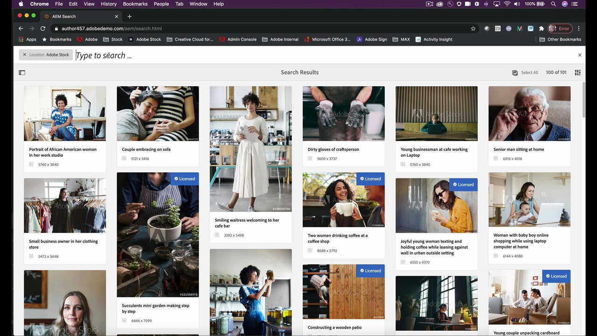

# [!DNL Stock]

クリエイターには、注目を集めて維持できる、視覚的に説得力のある新しいコンテンツをすばやく提供しなければならないというプレッシャーがかかっています。 Adobe [!DNL Stock] エンタープライズ版では、クリエイティブチームは毎日使用するAdobeのクリエイティブアプリから 2 億点以上の画像、ビデオ、テンプレート、イラスト、オーディオファイル、3D アセットにアクセスできます。

## 製品Tutorials

<table style="table-layout:fixed">
<tr>
 <td>
   
    

   <a href="stock.md#tutorial1"><strong>Adobe [!DNL Stock]</strong></a>
    

    <em>アドビの人工知能エンジン、Adobe Senseiを利用した高品質で高速な検索結果により、ロイヤリティフリーのストック画像を検索してクリエイティブプロジェクトを強化できます</em>
     
  </td>
  <td>
   
    

   <a href="stock.md#tutorial2"><strong>検索とライセンス [!DNL Stock] Adobe Experience Managerのアセット</strong></a>
    

    <em>簡単な手順でライセンスAdobe [!DNL Stock] デジタルアセット管理システムへのアセットの取り込み</em>
     
  </td>
  <td>
    
    

     
  </td>
</tr>
</table>

## Adobe [!DNL Stock] (10:49) {#tutorial1}

>[!VIDEO](https://video.tv.adobe.com/v/326951?hidetitle=true)

**説明**
アドビの人工知能エンジンであるAdobe Senseiを利用した、より優れた検索結果をすばやく利用して、ロイヤリティフリーの完璧なストック画像を検索し、クリエイティブプロジェクトを強化できます。

このチュートリアルでは、次の方法について学習します。
* 高品質の画像やビデオを検索する際の時間とストレスを解消しましょう
* エンタープライズ全体でアセットのライセンスと使用状況を簡単に管理して追跡できます
* Adobe Creative Cloudアプリ内で検索、プレビュー、ライセンス購入

**提供 :**

ビクトリア・トレス [!DNL Stock] ソリューションコンサルタント（デジタルメディア）

## 検索とライセンス [!DNL Stock] AEMのアセット (6:46) {#tutorial2}

>[!VIDEO](https://video.tv.adobe.com/v/326952?hidetitle=true)

**説明**
簡単な手順でライセンスAdobe [!DNL Stock] デジタルアセット管理システムにアセットを追加できます。

このチュートリアルでは、次の方法について学習します。
* 実行Adobe [!DNL Stock] AEMワークスペース内でのアセット検索
* ライセンス購入時に、ライセンス購入済みアセットをAEMフォルダーに直接保存する
* AEMからライセンス認証されたアセットを [!DNL Stock] のライセンス履歴 [!DNL Stock] web サイトを開きます。

**提供元：**
Emily Palmer、ソリューションコンサルタント（デジタルメディア）

![[!DNL Stock] ロゴ](../assets/st_appicon_96.png)

**Adobe [!DNL Stock] 関連情報**

[ラーニングとサポート](https://helpx.adobe.com/support/stock.html) は、その他のチュートリアルやコミュニティフォーラムへのリンクを掲載しています。

**2020 年 10 月リリース**

これらの機能をぜひご利用ください（その他） Creative Cloudデスクトップアプリケーションから最新のアップデートをダウンロードします。
