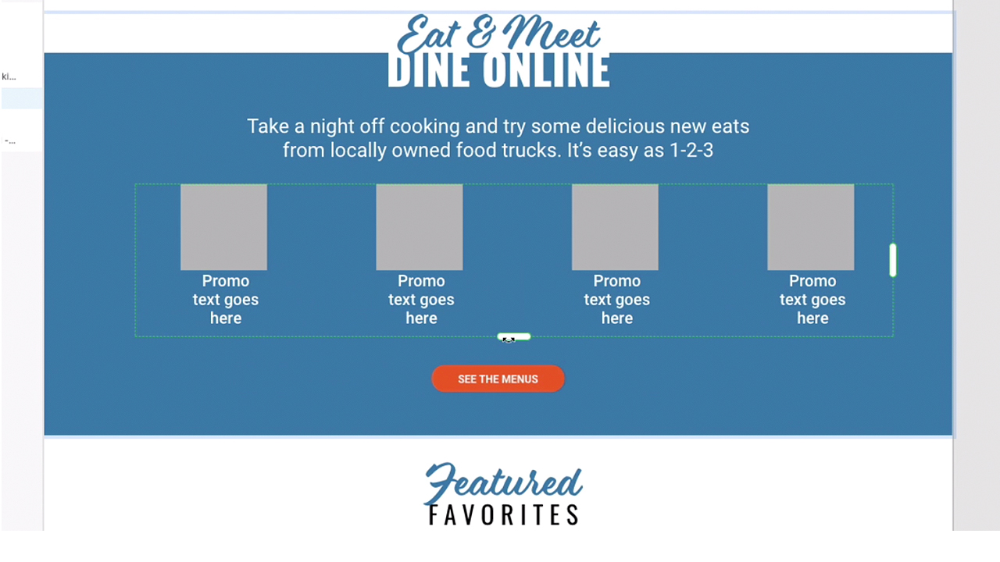

# XD

Adobe XDは、webサイト、アプリ、音声インターフェイス、ゲーム、およびその他の種類のデジタルエクスペリエンスをデザインするためのユーザーエクスペリエンスデザインおよびプロトタイピングツールです。

## 製品のTutorialsを参照

<table style="table-layout:fixed">
<tr>
 <td>
   
    

   <a href="xd.md#tutorial1"><strong>ホバーステートのあるコンポーネントの作成</strong></a>
    

    <em>インタラクティブなデザインに再利用可能で動的にサイズ変更可能なボタンを作成</em>
     
  </td>
  <td>
    
    

    <a href="xd.md#tutorial2"><strong>リピートグリッドの作成と設定</strong></a>
    

    <em>クリック&amp;ドラッグするだけで、単一の要素を繰り返しグリッドに変換できます</em>
     
  </td>
  <td>
   
    

    <a href="xd.md#tutorial3"><strong>スタックの操作</strong></a>
    

    <em>要素を簡単に並べ替えるには、スタックプロパティを使用します</em>
     
  </td>
</tr>
<tr>
 <td>
    
    

    <a href="xd.md#tutorial4"><strong>プロトタイプの作成 – アンカーリンクと 
スクロールグループ</strong></a>
    

    <em>プロトタイプへのナビゲーションとスクロールの追加</em>
     
  </td>
  <td>
    
    

    <a href="xd.md#tutorial5"><strong>プロトタイプを作成する – 対話型コンポーネントの状態</strong></a>
    

    <em>プロトタイプにインタラクティブ機能とオーバーレイメニューを追加</em>
     
  </td>
  <td>
   
    

   <a href="xd.md#tutorial7"><strong>電子メール – リピートグリッドの作成と設定</strong></a>
    

    <em>クリック&amp;ドラッグするだけで、単一の要素を繰り返しグリッドに変換できます</em>
     
  </td>
</tr>
<tr>
 <td>
    
    

    <a href="xd.md#tutorial7"><strong>電子メール – スタックの操作</strong></a>
    

    <em>要素を簡単に並べ替えるには、スタックプロパティを使用します</em>
     
  </td>
  <td>
    
    

     
  </td>
  <td>
    
    

     
  </td>
</tr>
</table>

## ホバーステートを使用した[!UICONTROL コンポーネント]の作成(7:35) {#tutorial1}

>[!VIDEO](https://video.tv.adobe.com/v/326874?hidetitle=true)

**説明**
インタラクティブなデザインに、再利用可能で動的にサイズ変更できるボタンを作成します。

このチュートリアルでは、次の方法を学習します。
* ソースメインコンポーネントに変更を加えると、その変更はそのコンポーネントのすべてのインスタンスに自動的にプッシュされます
* 一貫性を保ち、時間を節約し、少ないクリック数でコンポーネントを使用

**発表者：**
シニアソリューションコンサルタント（デジタルメディア）、Michael Murphy氏

## リピートグリッドの作成と設定(2:57) {#tutorial2}

>[!VIDEO](https://video.tv.adobe.com/v/326955?hidetitle=true)

**説明**
クリック&amp;ドラッグするだけで、単一の要素を繰り返しグリッドに変換できます。

このチュートリアルでは、次の方法を学習します。
* ワークフローを強化し、必要なサイズのグリッドを即座にドラッグします
* 実際のコンテンツとデータを取り込むと、XDがすべての画像とテキストを魔法のようにグリッドに配置します
* 一度変更を加え、好きな場所や方向に適用します

**発表者：**
シニアソリューションコンサルタント（デジタルメディア）、Ashley Dvorin氏

## スタックの操作(5:33) {#tutorial3}

>[!VIDEO](https://video.tv.adobe.com/v/326956?hidetitle=true)

**説明**
要素を簡単に再配置するには、stackプロパティを使用します。

このチュートリアルでは、次の方法を学習します。
* デザインが変更されても、カンバス上のオブジェクト間の整列と間隔を維持します
* スタックに新しいオブジェクトを挿入したり、オブジェクトを並べ替えたりすると、すべてが自動的に調整されます

**発表者：**
シニアソリューションコンサルタント（デジタルメディア）、Michael Murphy氏

## プロトタイプの作成 – アンカーリンクとスクロールグループ(9:55) {#tutorial4}

>[!VIDEO](https://video.tv.adobe.com/v/326957?hidetitle=true)

**説明**
プロトタイプにナビゲーションとスクロールを追加します。

このチュートリアルでは、次の方法を学習します。
* ユーザーが同じアートボード上の別のポイントにジャンプできるようにするアクションを使用して、プロトタイプにリンクを追加します
* アクティビティフィード、画像カルーセル、製品リストなどを、他のデザインとは別にスクロールする領域を定義して作成します
* 垂直、水平、またはその両方にスクロールするグループを作成します

**発表者：**
シニアソリューションコンサルタント（デジタルメディア）、Michael Murphy氏

## プロトタイプの作成 – インタラクティブなコンポーネントのステート(8:55) {#tutorial5}

>[!VIDEO](https://video.tv.adobe.com/v/326958?hidetitle=true)

**説明**
プロトタイプにインタラクティブ機能とオーバーレイメニューを追加します。

このチュートリアルでは、次の方法を学習します。
* 追加のアートボードを必要とせずに、ノンリニアインタラクティブでアニメーション化されたユーザーエクスペリエンスを作成します
* 1つのXDドキュメントで複数のプロトタイプフローまたはインタラクションフローを作成し、各フローに対して一意の共有可能なリンクを公開します

**発表者：**
アソシエイトソリューションコンサルタント、Emilie Enke氏（デジタルメディア）

## 電子メール – リピートグリッドの作成と設定(4:45) {#tutorial6}

>[!VIDEO](https://video.tv.adobe.com/v/326775?hidetitle=true)

**説明**
クリック&amp;ドラッグするだけで、単一の要素を繰り返しグリッドに変換できます。

このチュートリアルでは、次の方法を学習します。
* ワークフローを強化し、必要なサイズのグリッドを即座にドラッグします
* 実際のコンテンツとデータを取り込むと、XDがすべての画像とテキストを魔法のようにグリッドに配置します
* 一度変更を加え、好きな場所や方向に適用します

**発表者：**
Victoria Torres、ソリューションコンサルタント（デジタルメディア）

## 電子メール – スタックの操作(3:38) {#tutorial7}

>[!VIDEO](https://video.tv.adobe.com/v/326759?hidetitle=true)

**説明**
要素を簡単に再配置するには、stackプロパティを使用します。

このチュートリアルでは、次の方法を学習します。
* デザインが変更されても、カンバス上のオブジェクト間の整列と間隔を維持します
* スタックに新しいオブジェクトを挿入したり、オブジェクトを並べ替えたりすると、すべてが自動的に調整されます

**発表者：**
Victoria Torres、ソリューションコンサルタント（デジタルメディア）

**XDリソース**

[ラーニングとサポート](https://helpx.adobe.com/jp/support/xd.html)は、追加のチュートリアル、[新機能](https://helpx.adobe.com/xd/user-guide.html/xd/help/whats-new.ug.html)、およびコミュニティフォーラムへのリンクのハブです。

**2020年10月リリース**

これらの機能の使用を開始しましょう（さらに多くの機能を使用できます）。 Creative Cloudのデスクトップアプリから最新のアップデートをダウンロードする方法を説明します。
