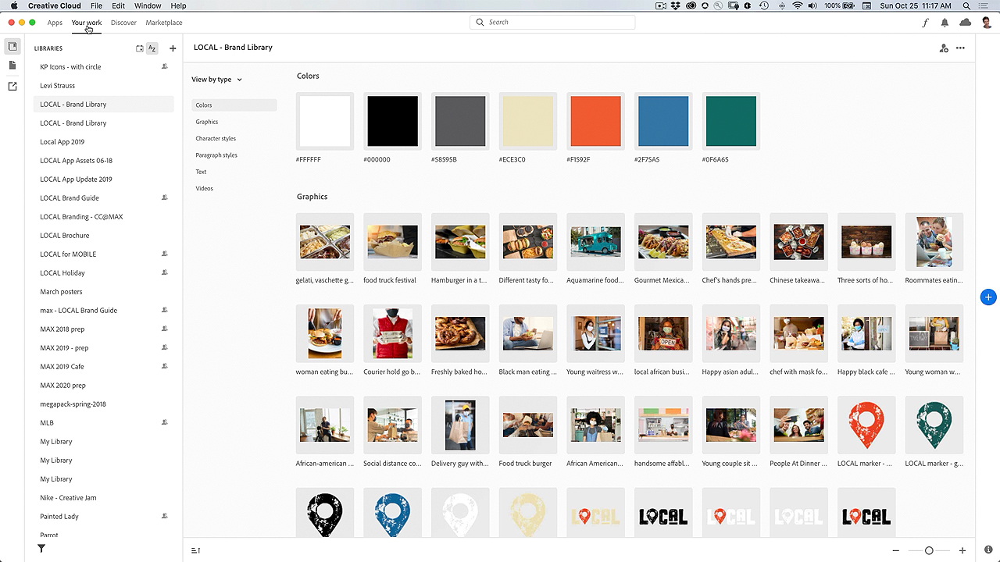

# Creative Cloud デスクトップアプリケーション

Creative Cloudデスクトップアプリケーションは、CC アプリケーション、サービス、共同作業などを管理するためのハブです。

## 製品Tutorials

<table style="table-layout:fixed">
<tr>
 <td>
   
    

   <a href="creativeclouddesktopapp.md#tutorial1"><strong>CC デスクトップアプリケーションを見る：Creative Cloudハブ</strong></a>
    

    <em>Creative Cloudデスクトップアプリケーションは、CC アプリケーション、サービス、共同作業などを管理するためのハブです。</em>
     
  </td>
  <td>
    
    

     
  </td>
  <td>
    
    

     
  </td>
</tr>
</table>

## CC デスクトップアプリケーションを見る：Creative Cloudハブ (2:50) {#tutorial1}

>[!VIDEO](https://video.tv.adobe.com/v/327095?hidetitle=true)

**説明**
Creative Cloudデスクトップアプリケーションは、CC アプリケーション、サービス、共同作業などを管理するためのハブです。

このチュートリアルでは、次の方法について学習します。
* デスクトップアプリケーションの起動とアップデート
* モバイルアプリと web アプリの検索
* アセットの管理と共有
* AccessAdobe Fonts
* チュートリアルを見る
* Behanceでの作品の共有

**提供元：**
Patti Sokol、プリンシパルソリューションコンサルタント（デジタルメディア）
