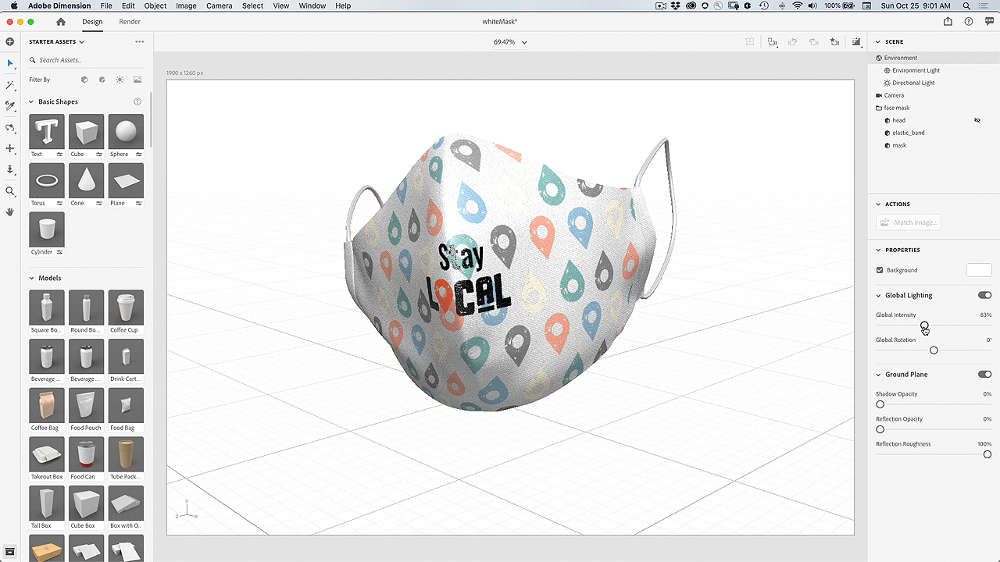

# プラグインを印刷するデザイン – 面マスクをカスタマイズする

自分の絵で顔のマスクをカスタマイズできたら、すごくいいと思いませんか？ Adobe Design to Printプラグインを使用すると、数百ものZazle製品でデザインを視覚化し、オンライン市場に直接公開できます。

## FaceMaskプロジェクトチュートリアルを参照

<table style="table-layout:fixed">
<tr>
 <td>
   
    

   <a href="handsonproject.md#tutorial1"><strong>Photoshop Designをインストールしてプラグインを印刷</strong></a>
    

    <em>Adobe Photoshopの強力な選択ツールとカラー編集ツールを使用して、企業のブランド活動のニーズに合わせて画像を大幅に変更できます。</em>
     
  </td>
  <td>
    
    

    <a href="handsonproject.md#tutorial2"><strong>印刷するデザインを使用して面マスクをカスタマイズする</strong></a>
    

    <em>独自のZazleフェイスマスクをカスタマイズする</em>
     
  </td>
  <td>
    
    

   <a href="handsonproject.md#tutorial3"><strong>面マスクの3Dビジュアル化を作成する</strong></a>
    

    <em>イベントギャラリー用の面マスクの3Dビジュアル化を作成する</em>
     
  </td>
</tr>
</table>

## Photoshop Designをインストールしてプラグインを印刷(1:50) {#tutorial1}

>[!VIDEO](https://video.tv.adobe.com/v/327096?hidetitle=true)

**説明Design**
to Print Plug-in for Photoshopをインストールする方法を説明します。

このチュートリアルでは、次の方法を学習します。
* 衣類、アクセサリー、文房具、壁掛けなどの製品のデザインをリアルタイムで表示できます。
* Dazzulオンラインマーケットプレースに公開

**提供者：**
Patti Sokol氏、主要ソリューション・コンサルタント（デジタル・メディア）

## 印刷するデザインを使用して面マスクをカスタマイズする(7:54) {#tutorial2}

>[!VIDEO](https://video.tv.adobe.com/v/327097?hidetitle=true)

**説**
明Zazleの面マスクをカスタマイズ

このチュートリアルでは、次の方法を学習します。
* 衣類、アクセサリー、文房具、壁掛けなどの製品のデザインをリアルタイムで表示できます。
* Dazzulオンラインマーケットプレースに公開

**「イメージ」をクリックしてダウンロードLearn DesignでPDFを印刷**

**提供者：**
Patti Sokol氏、主要ソリューション・コンサルタント（デジタル・メディア）

## 面マスクの3Dビジュアル化を作成する(7:54) {#tutorial3}

>[!VIDEO](https://video.tv.adobe.com/v/327098?hidetitle=true)

**説明イ**
ベントギャラリー用の面マスクの3Dビジュアル化を作成します

このチュートリアルでは、次の方法を学習します。
* 写実的な3D視覚エフェクトを簡単に作成
* マテリアルを追加し、プロの外観の照明を制御する
* ブランドや他のデザインを適用するための資産のインポート

**[イメージ]をクリックして、3Dモデ [!DNL Dimension] ルのホワイトマスクを使用してファイルをダウンロードします。**

**提供者：**
Patti Sokol氏、主要ソリューション・コンサルタント（デジタル・メディア）
