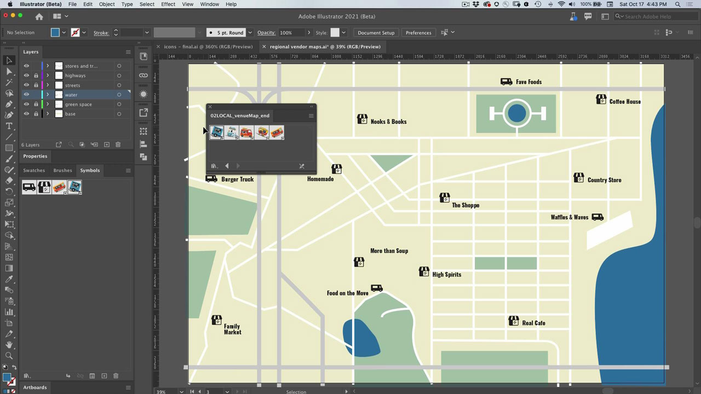
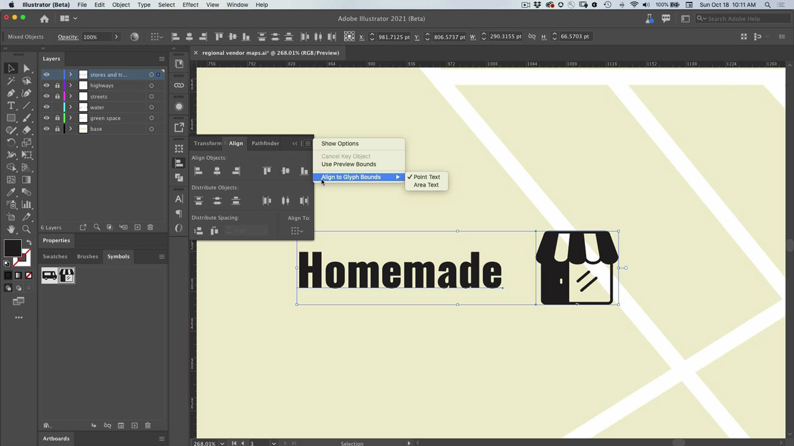

# Illustrator

最新のイラストやグラフィックス用アプリ。 Web、モバイル、印刷用のロゴ、アイコン、イラスト、その他のデザインを作成します。

## 製品チュートリアルの参照

<table style="table-layout:fixed">
<tr>
 <td>
   
    

   <a href="illustrator.md#tutorial1"><strong>シンボルを使用して複数のアイコンインスタンスを更新する</strong></a>
    

    <em>手作業を軽減し、記号との整合性を維持</em>
     
  </td>
  <td>
    
    

    <a href="illustrator.md#tutorial2"><strong>文字とイメージを記号のスナップに合わせる</strong></a>
    

    <em>文書の重要な領域にグリフをすばやくスナップする</em>
     
  </td>
  <td>
    
    

     
  </td>
</tr>
</table>

## シンボルを使用して複数のアイコンインスタンスを更新する(5:08) {#tutorial1}

>[!VIDEO](https://video.tv.adobe.com/v/326816?hidetitle=true)

**説明手**
作業を減らし、記号との整合性を維持します。

このチュートリアルでは、次の方法を学習します。
* 手作業を軽減し、記号との整合性を維持

**提供者：**
Patti Sokol氏、主要ソリューション・コンサルタント（デジタル・メディア）

## 文字とイメージを字形スナップに合わせる(6:48) {#tutorial2}

>[!VIDEO](https://video.tv.adobe.com/v/326817?hidetitle=true)

**説明文**
書の重要な領域にグリフをすばやくスナップします。

このチュートリアルでは、次の方法を学習します。
* 文書の重要な領域にグリフをすばやくスナップする

**提供者：**
Patti Sokol氏、主要ソリューション・コンサルタント（デジタル・メディア）

**Illustratorリソース**

[追加のチュート](https://helpx.adobe.com/support/illustrator.html) リアルやコミュニティフォーラムへのリンクは、ご利用のハブを参照してください。

**2020年10月リリース**

これらの機能の使用を開始します（その他！） Creative Cloud Desktop Appから最新の更新プログラムをダウンロードします。
