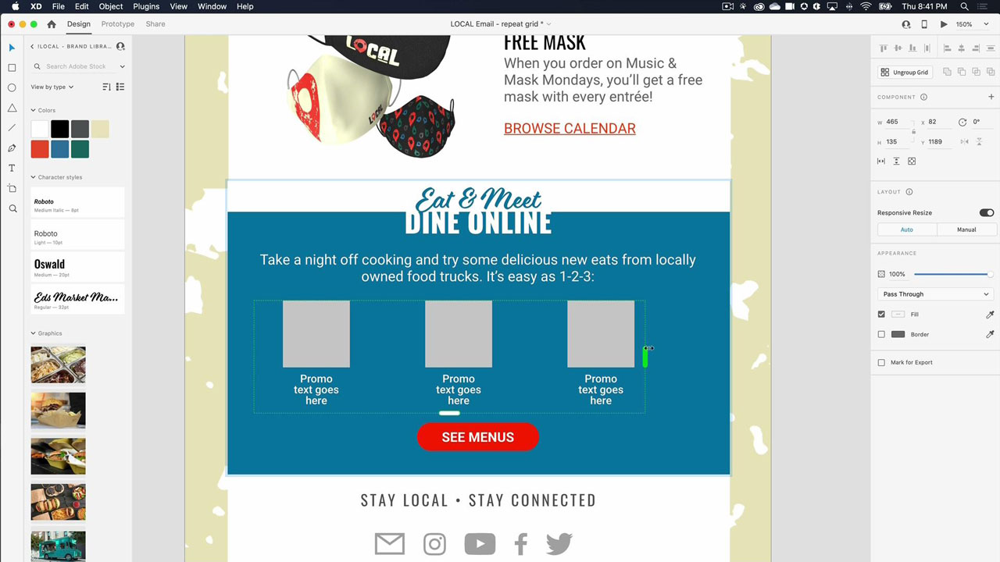

# XD

Adobe XDは、web サイト、アプリ、音声インターフェイス、ゲームなどのデジタルエクスペリエンスをデザインするための、UX デザインおよびプロトタイプ作成ツールです。

## 製品Tutorials

<table style="table-layout:fixed">
<tr>
 <td>
   
    

   <a href="xd.md#tutorial1"><strong>ホバーステートを持つコンポーネントの作成</strong></a>
    

    <em>インタラクティブなデザイン用に、再利用可能で動的にサイズ変更可能なボタンを作成できます</em>
     
  </td>
  <td>
    
    

    <a href="xd.md#tutorial2"><strong>リピートグリッドの作成と設定</strong></a>
    

    <em>クリック&amp;ドラッグするだけで、1 つの要素をリピートグリッドに変換できます</em>
     
  </td>
  <td>
   
    

    <a href="xd.md#tutorial3"><strong>スタックの操作</strong></a>
    

    <em>要素を簡単に並べ替えるには、stack プロパティを使用します</em>
     
  </td>
</tr>
<tr>
 <td>
    
    

    <a href="xd.md#tutorial4"><strong>プロトタイプの作成 — アンカーリンクとスクロールグループ</strong></a>
    

    <em>プロトタイプへのナビゲーションとスクロールの追加</em>
     
  </td>
  <td>
    
    

    <a href="xd.md#tutorial5"><strong>プロトタイプの作成 — インタラクティブコンポーネントのステート</strong></a>
    

    <em>プロトタイプにインタラクティブ機能とオーバーレイメニューを追加する</em>
     
  </td>
  <td>
   
    

   <a href="xd.md#tutorial7"><strong>電子メール — リピートグリッドの作成と設定</strong></a>
    

    <em>クリック&amp;ドラッグするだけで、1 つの要素をリピートグリッドに変換できます</em>
     
  </td>
</tr>
<tr>
 <td>
    
    

    <a href="xd.md#tutorial7"><strong>電子メール — スタックの使用</strong></a>
    

    <em>要素を簡単に並べ替えるには、stack プロパティを使用します</em>
     
  </td>
  <td>
    
    

     
  </td>
  <td>
    
    

     
  </td>
</tr>
</table>

## 作成 [!UICONTROL コンポーネント] ホバーステートの使用 (7:35) {#tutorial1}

>[!VIDEO](https://video.tv.adobe.com/v/326874?hidetitle=true)

**説明**
インタラクティブなデザイン用に、再利用可能で動的にサイズ変更可能なボタンを作成します。

このチュートリアルでは、次の方法について学習します。
* ソースのメインコンポーネントに変更を加えると、その変更はそのコンポーネントのすべてのインスタンスに自動的にプッシュされます
* 一貫性を保ち、時間を節約し、クリック数を減らすためにコンポーネントを使用する

**提供元：**
Michael Murphy、シニアソリューションコンサルタント（デジタルメディア）

## リピートグリッドの作成と設定 (2:57) {#tutorial2}

>[!VIDEO](https://video.tv.adobe.com/v/326955?hidetitle=true)

**説明**
クリック&amp;ドラッグするだけで、1 つの要素をリピートグリッドに変換できます。

このチュートリアルでは、次の方法について学習します。
* ワークフローを加速。必要なサイズのグリッドを瞬時にドラッグして作成できます
* 実際のコンテンツやデータを取り込むと、XDがすべての画像とテキストを魔法のようにグリッドに配置します
* 一度変更すれば、どこにでも、どの方向にも適用できます

**提供元：**
Ashley Dvorin、シニアソリューションコンサルタント（デジタルメディア）

## スタックの使用 (5:33) {#tutorial3}

>[!VIDEO](https://video.tv.adobe.com/v/326956?hidetitle=true)

**説明**
要素を簡単に再配置するには、stack プロパティを使用します。

このチュートリアルでは、次の方法について学習します。
* デザインを変更しても、カンバス上でオブジェクト同士の位置関係と間隔を維持できます
* スタックに新しいオブジェクトを挿入したり、スタック内でオブジェクトの順序を変更したりすると、すべての設定が自動的に調整されます

**提供元：**
Michael Murphy、シニアソリューションコンサルタント（デジタルメディア）

## プロトタイプの作成 — アンカーリンクとスクロールグループ (9:55) {#tutorial4}

>[!VIDEO](https://video.tv.adobe.com/v/326957?hidetitle=true)

**説明**
プロトタイプにナビゲーションとスクロールを追加します。

このチュートリアルでは、次の方法について学習します。
* リンクをプロトタイプに追加するとき、ユーザーを同じアートボード上の異なるポイントにジャンプさせるアクションを利用できます
* デザインの他の領域からは独立してスクロールする領域を定義して、アクティビティフィードや画像カルーセル、製品一覧などを作成できます
* 垂直方向、水平方向、またはその両方にスクロールするグループを作成します

**提供元：**
Michael Murphy、シニアソリューションコンサルタント（デジタルメディア）

## プロトタイプの作成 — インタラクティブコンポーネントのステート (8:55) {#tutorial5}

>[!VIDEO](https://video.tv.adobe.com/v/326958?hidetitle=true)

**説明**
プロトタイプにインタラクティブ機能とオーバーレイメニューを追加します。

このチュートリアルでは、次の方法について学習します。
* アートボードを追加することなく、ノンリニアのインタラクティブなアニメーションユーザーエクスペリエンスを作成できます
* プロトタイプやインタラクションの複数のフローを 1 つのXDドキュメント内に生成し、共有可能な一意のリンクをフローごとに公開します

**提供元：**
Emilie Enke、アソシエイトソリューションコンサルタント（デジタルメディア）

## 電子メール — リピートグリッドの作成と設定 (4:45) {#tutorial6}

>[!VIDEO](https://video.tv.adobe.com/v/326775?hidetitle=true)

**説明**
クリック&amp;ドラッグするだけで、1 つの要素をリピートグリッドに変換できます。

このチュートリアルでは、次の方法について学習します。
* ワークフローを加速。必要なサイズのグリッドを瞬時にドラッグして作成できます
* 実際のコンテンツやデータを取り込むと、XDがすべての画像とテキストを魔法のようにグリッドに配置します
* 一度変更すれば、どこにでも、どの方向にも適用できます

**提供元：**
Victoria Torres、ソリューションコンサルタント（デジタルメディア）

## 電子メール — スタックの使用 (3:38) {#tutorial7}

>[!VIDEO](https://video.tv.adobe.com/v/326759?hidetitle=true)

**説明**
要素を簡単に再配置するには、stack プロパティを使用します。

このチュートリアルでは、次の方法について学習します。
* デザインを変更しても、カンバス上でオブジェクト同士の位置関係と間隔を維持できます
* スタックに新しいオブジェクトを挿入したり、スタック内でオブジェクトの順序を変更したりすると、すべての設定が自動的に調整されます

**提供元：**
Victoria Torres、ソリューションコンサルタント（デジタルメディア）

**XD Resources**

[ラーニングとサポート](https://helpx.adobe.com/support/xd.html) は、その他のチュートリアルのハブです。 [新機能](https://helpx.adobe.com/xd/user-guide.html/xd/help/whats-new.ug.html)コミュニティフォーラムへのリンクも含まれています。

**2020 年 10 月リリース**

これらの機能をぜひご利用ください（その他） Creative Cloudデスクトップアプリケーションから最新のアップデートをダウンロードします。
