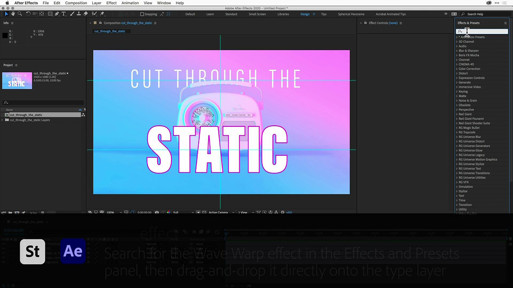
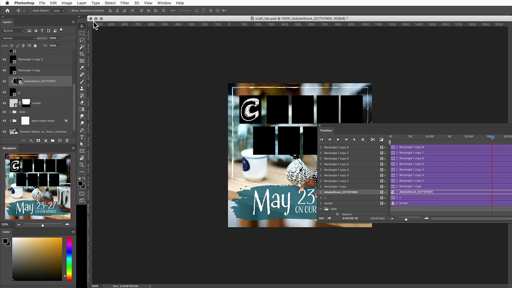
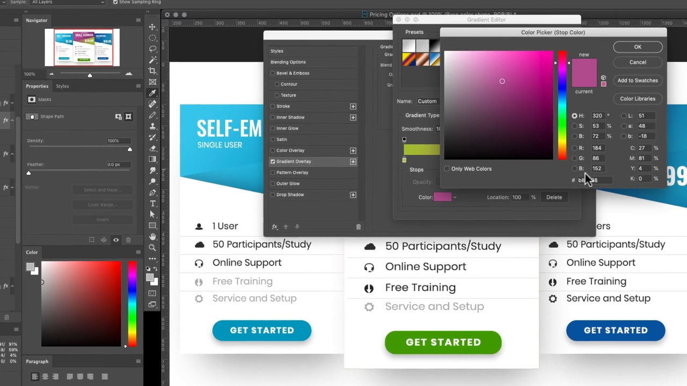
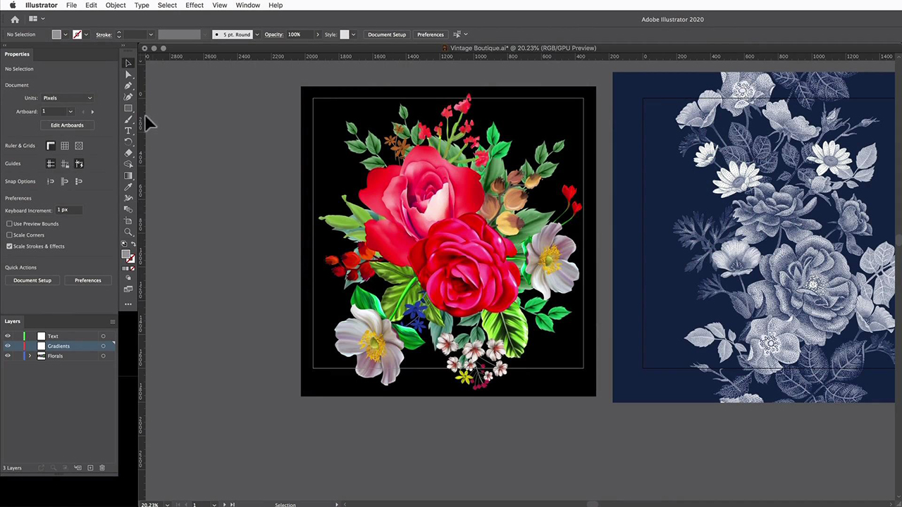
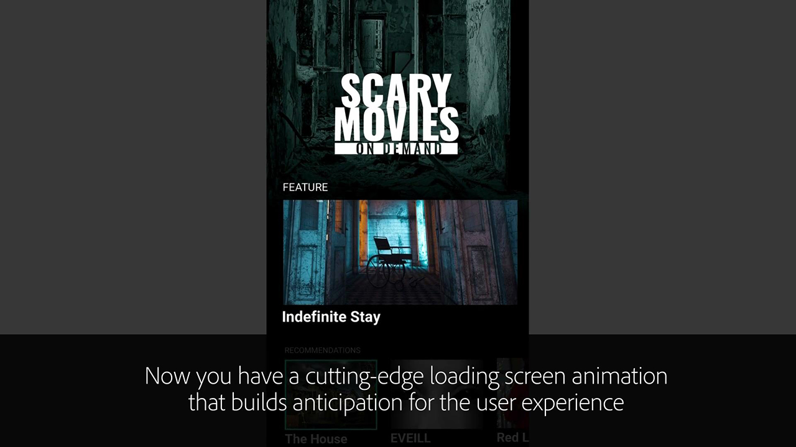
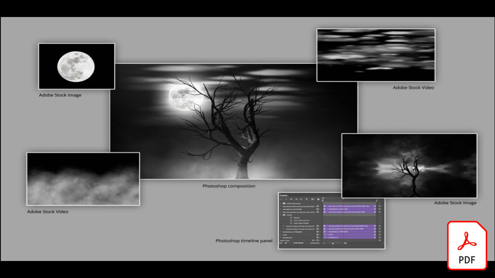

# Adobe [!DNL Stock]チュートリアル

!

新しい、視覚的に魅力的なコンテンツを迅速に提供し、注目を集めるよう、創造主は迫られています。 企業向けAdobe [!DNL Stock]は、2億を超える画像、ビデオ、テンプレート、イラスト、オーディオファイル、3D資産に、クリエイティブ・チームが毎日使用するAdobeクリエイティブ・アプリケーションからアクセスできるようにします。

## クリックしてAdobe [!DNL Stock]のチュートリアルを表示

<table>
<tr>
   <td>
      
      

      <a href="searchstock.md"><strong>Adobe [!DNL Stock]ライセンス履歴を検索</strong></a>
      

      <em>企業向けCreative Cloudで組織のAdobe [!DNL Stock]ライセンス履歴をすばやく検索する方法を説明します。</em>
       
  </td>
  <td>
      
      

      <a href="handdrawn.md"><strong>Adobe [!DNL Stock]イメージに手描きの美意識を追加する</strong></a>
      

      <em>iPad用Photoshopを使用して、画像に奥行きや寸法を加える独自のテクニックを使用して、クリエイティブなマーケティングを強化</em>
       
  </td>
  <td>
   
    

   <a href="flairtypography.md"><strong>マスクとアニメーションを使用した文字体裁に鮮明さを加える</strong></a>
    

    <em>Adobe [!DNL Stock]の要素とAfter Effectsのアニメーションスタイルを使用して、テキストを生き生きと表示します。</em>
     
  </td>
</tr>
<tr>
   <td>
      
      

      <a href="animatevector.md"><strong>PhotoshopでのAdobe [!DNL Stock]ベクトルの図のアニメーション</strong></a>
      

      <em>Adobe [!DNL Stock]の編集可能なベクトルを使用して、アニメーションをニュースレターのグラフィックに取り込む</em>
       
  </td>
   <td>
      
      

      <a href="annualreport.md"><strong>Adobe [!DNL Stock]およびSpark Videoで作成されたビデオで年次報告を開始</strong></a>
      

      <em>Adobe [!DNL Stock]とSpark Videoで年次報告を作成する</em>
       
  </td>
  <td>
      
      

      <a href="customanimations.md"><strong>Adobe [!DNL Stock]のカスタムアニメーションを使用して、創造力を生き生きと発揮</strong></a>
      

      <em>PhotoshopでカスタムアニメーションにAdobe [!DNL Stock]の画像、テクスチャ、パターンを使用する</em>
       
  </td>
</tr>
<tr>
   <td>
      
      

      <a href="changecolors.md"><strong>Adobe [!DNL Stock]イメージの色をストーリーに合わせて変更する</strong></a>
      

      <em>Adobe [!DNL Stock]で一意の写真を検索し、Adobe Photoshopで必要に応じて色を調整します</em>
       
  </td>
  <td>
      
      

      <a href="collage.md"><strong>Adobe [!DNL Stock]イメージを使用してポスター用の3Dコラージュを作成する</strong></a>
      

      <em>Adobe [!DNL Stock]の画像から見る目を引く3D効果を備えたAdobe Illustratorでのコラージュのデザイン</em>
       
  </td>
  <td>
      
      

      <a href="boldlabel.md"><strong>Adobe [!DNL Stock]テンプレートとPhotoshop Smart Objectsを使用して太字のラベルを作成する</strong></a>
      

      <em>Adobe [!DNL Stock]のリアルなパッケージテンプレートを使用して、カスタムデザインをデザインおよび視覚化します。</em>
       
  </td>
</tr>
<tr>
   <td>
      
      

      <a href="infographic.md"><strong>Adobe [!DNL Stock]を使用して、企業のガイドライン情報グラフィックを作成します</strong></a>
      

      <em>Adobe [!DNL Stock]のさまざまなアセットを組み合わせて、視覚的に魅力的な情報グラフィックスの形でガイドラインを伝達</em>
       
  </td>
 <td>
      
      

      <a href="featurecomparison.md"><strong>Adobe [!DNL Stock]を使用して製品機能比較表を作成する</strong></a>
      

      <em>製品価格プランを比較して、見込み客に必要な情報を一目で把握するグラフィックを作成します。</em>
       
  </td>
  <td>
      
      

      <a href="surrealcomposite.md"><strong>Adobe [!DNL Stock]を使用して半実数のコンポジットを作成する</strong></a>
      

      <em>複数のイメージをカラー、モーション、マスキング効果と組み合わせて、思い出に残る編集イメージを作成します。</em>
       
  </td>
</tr>
<tr>
   <td>
      
      

      <a href="surrealpattern.md"><strong>Adobe [!DNL Stock]で半実数パターンを作成する</strong></a>
      

      <em>Adobe [!DNL Stock]の超現実的な画像に基づいた、美しいシームレスなパターンの作成</em>
       
  </td>
   <td>
      
      

      <a href="productconfigurator.md"><strong>Adobe [!DNL Stock]を使用した対話型製品コンフィギュレータの作成</strong></a>
      

      <em>Adobe [!DNL Stock]のインタラクティビティ、アニメーション、編集可能なアートワークを使用して、財務情報を視覚的に表示します。</em>
       
  </td>
  <td>
      
      

      <a href="interactivetourismphoto.md"><strong>Adobe [!DNL Stock]とXDを使用して、インタラクティブな観光写真を作成します。</strong></a>
      

      <em>Adobe [!DNL Stock] &amp; XDを使用して、Webサイトのプロトタイプ内にインタラクティブな写真をすばやく作成できます。</em>
       
  </td>
</tr>
<tr>
   <td>
      
      

      <a href="animationemail.md"><strong>Adobe [!DNL Stock]およびPhotoshopを使用して電子メールのアニメーションを作成する</strong></a>
      

      <em>Adobe [!DNL Stock]とPhotoshopを使用して、Stop-Action AnimationでEメールをパワーアップ</em>
       
  </td>
 <td>
      
      

      <a href="brandgradients.md"><strong>美しいグラデーションとAdobe [!DNL Stock]資産を使用して、まとまったブランドイメージを作成</strong></a>
      

      <em>広告キャンペーン全体で色とグラデーションを組み合わせ、さまざまな画像でブランドの統一性を実現</em>
       
   </td>
  <td>
      
      

      <a href="webgraphics.md"><strong>Adobe [!DNL Stock]イメージをCSSと組み合わせて、魅力的なWebグラフィックを作成</strong></a>
      

      <em>広告キャンペーン全体で色とグラデーションを組み合わせ、さまざまな画像でブランドの統一性を実現</em>
       
  </td>
</tr>
<tr>
   <td>
      
      

      <a href="moodboard.md"><strong>Adobe [!DNL Stock]を使用して、気分を刺激するボードをすぐに作成</strong></a>
      

      <em>プロジェクトムードボードを作成し、情報、アイデア、ビジュアル、カラーパレットをチーム/クライアントに伝える</em>
       
  </td>
  <td>
      
      

      <a href="realisticcomposite.md"><strong>Adobe [!DNL Stock]イメージを使用したリアルなフォトコンポジットの作成</strong></a>
      

      <em>Adobe [!DNL Stock]の優れた写真を2枚集めて、人々をソーシャルポストに引き込みます。</em>
       
  </td>
   <td>
   
    

   <a href="loadingscreen.md"><strong>Adobe [!DNL Stock]とXDを使用して読み込み画面のアニメーションをカスタマイズする</strong></a>
    

    <em>Adobe [!DNL Stock]のベクトルアートワークをカスタマイズして、モバイルアプリ用にチル化読み込み画面のアニメーションを作成</em>
     
  </td>
</tr>
<tr>
   <td>
   
    

   <a href="presentationtemplate.md"><strong>Adobe [!DNL Stock]プレゼンテーションテンプレートをカスタマイズして、プロ並みの外観を実現</strong></a>
    

    <em>Adobe [!DNL Stock]のイメージとテンプレートを使用し、簡単に実行できる特殊効果を使用して、数分で美しいスタイルのプレゼンテーションを作成できます。</em>
     
  </td>
   <td>
   
    

   <a href="customizecolors.md"><strong>Adobe [!DNL Stock]ベクトル図の色をカスタマイズする</strong></a>
    

    <em>見た目の良いイラストを使用して、あらゆるプロジェクトに洗練を加えます。Adobe [!DNL Stock]で最適なベクトルを見つけ、Adobe Illustrator</em>を使用してプロジェクトのパレットにカラーを適用します。
     
  </td>
   <td>
      
      

      <a href="assets/AddMotiontoStillImageswithAdobeStockandPhotoshop.pdf"><strong>Adobe [!DNL Stock]およびPhotoshop (PDF)を使用して静止画にモーションを追加する</strong></a>
      

      <em>ビデオを静止画に組み込むことで、どの画面でも視聴者を驚かせます</em>
       
   </td>
</tr>
<tr>
   <td>
   
    

   <a href="assets/CreateacompositewithPhotoshopontheiPadandAdobeStockimages.pdf"><strong>iPadおよびAdobe [!DNL Stock]イメージ上でPhotoshopを使用してコンポジットを作成する(PDF)</strong></a>
    

    <em>iPadでPhotoshopの機能を活用し、お気に入りのAdobe Creative Cloudアプリを新しい方法で使用する方法を学習します</em>
     
  </td>
   <td>
   
    

   <a href="assets/CreateaUniqueEditorialGraphicwithAfterEffectsandAdobeStock.pdf"><strong>Adobe [!DNL Stock]ベクトル図をPhotoshopでアニメーション表示する(PDF)</strong></a>
    

    <em>After EffectsとAdobe [!DNL Stock]を組み合わせると、素早く素晴らしい特殊効果を作成し、ストーリーを視覚的に伝えることができます</em>
     
  </td>
   <td>
      
      

      <a href="assets/CreateUniqueGraphicsbyCombiningAdobeStockImages.pdf"><strong>Adobe [!DNL Stock]イメージを組み合わせて独自のグラフィックを作成する(PDF)</strong></a>
      

      <em>2つの異なるイメージを組み合わせて、設計プロジェクト用のまったく新しいシーンを作成します。Adobe [!DNL Stock]とAdobe Photoshopを使うと、簡単に</em>できます。
       
   </td>
</tr>
<tr>
   <td>
      
      

      <a href="assets/CreatingaHalloweenCinemagraphwithPhotoshopCCandAdobeStock.pdf"><strong>Photoshop CCとAdobe [!DNL Stock]を使用したハロウィーン映画グラフの作成(PDF)</strong></a>
      

      <em>Adobe Photoshopでビデオ、イラスト、写真を合成して、映画を作成する</em>
       
  </td>
   <td>
      
      

      <a href="assets/PutyourDatainMotionwithAdobeStockandPremierePro.pdf"><strong>Adobe [!DNL Stock]およびPremiere Pro (PDF)を使用してデータを移動する</strong></a>
      

      <em>Adobe [!DNL Stock]とAdobe Premiere Proを使用して、より説得力のあるストーリーを伝えるために、データを生き生きと保存します。</em>
       
  </td>
   <td>
      
      

      <a href="assets/RecolorAdobeStockVectorArtworkwithAdobeIllustratortoGetExactlytheLookYouWant.pdf"><strong>Adobe [!DNL Stock]ベクトルアートワークをAdobe Illustratorで再配色し、目的の外観に合わせます(PDF)</strong></a>
      

      <em>Adobe [!DNL Stock]を使用すると、独自のベクトルグラフィックを簡単に見つけることができ、Adobe Illustratorでは、クリエイティブな視覚に合わせてすばやく修正できます</em>
       
   </td>
 </tr> 
 <tr>
   <td>
      
      

      <a href="assets/ShowOffyourDesignWorkintheRealWorldwithAdobeStockandPhotoshop.pdf"><strong>Adobe [!DNL Stock]とPhotoshop (PDF)を使用して、デザイン作業を現実の世界に見せる</strong></a>
      

      <em>次の手順に従って、Adobe Photoshopを使用してリアルなAdobe [!DNL Stock]テンプレートで作業内容を紹介します</em>
       
  </td>
   <td>
      
      

      <a href="assets/UncoveramazingdetailsinAdobeStockimageswithLightroomformobile.pdf"><strong>Lightroom for mobile (PDF)を使用して、Adobe [!DNL Stock]の画像の詳細を明らかにする</strong></a>
      

      <em>モバイルデバイスでLightroomの機能を見つけ、画像を最高のものに</em>
       
  </td>
   <td>
      
      

      <a href="assets/VisualizePosterDesignsintheRealWorldwithAdobeStockandPhotoshop.pdf"><strong>Adobe [!DNL Stock]とPhotoshop (PDF)を使用して、実世界のポスターデザインを視覚化</strong></a>
      

      <em>現実の環境でデザインを紹介し、世界での見方をより良く理解できるようにします。</em>
       
  </td>
</tr>
</table>
