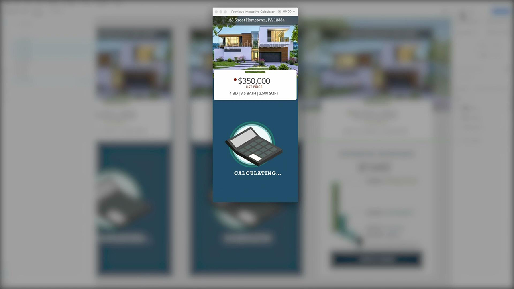
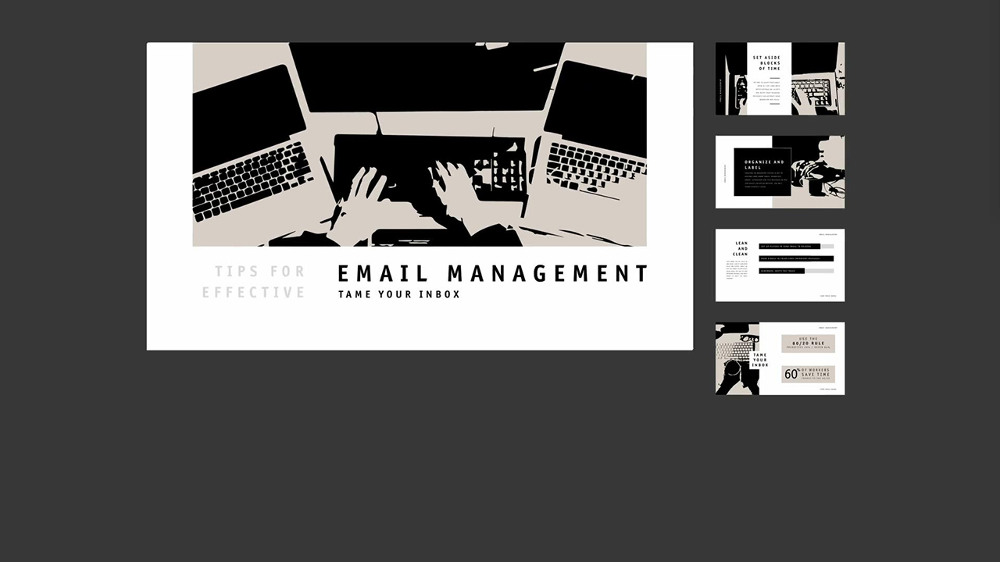

# Adobe [!DNL Stock]のチュートリアル

クリエイターは、魅力的なビジュアルコンテンツを迅速に提供することが求められています。 Adobe Stockを使用すると、クリエイティブチームは毎日使用するCreative Cloudアプリ内で3億点以上ものロイヤリティフリーの画像、ビデオ、オーディオファイル、テンプレート、イラスト、3Dアセットにアクセスできます。 Creative CloudのProエディションでは、Adobe Stockの通常アセットに無制限にアクセスできます。 stock.adobe.comで最新のコレクションをご覧ください。 画像を選択して、チュートリアルを表示します。

<table>
<tr>
   <td>
      
      

      <a href="stunning-digital-assets.md"><strong>魅力的なデジタルアセット(PDF)</strong></a>
      

      <em>この実践チュートリアルでは、Adobe StockとCC Librariesを連携させ、印刷およびスクリーン用に一貫性のあるプロフェッショナルなデザイン結果を作成する方法を説明します</em>
       
  </td>
  <td>
      
      

      <a href="searchstock.md"><strong>Adobe[!DNL Stock]のライセンス履歴の検索</strong></a>
      

      <em>法人のCreative Cloudで組織のAdobe [!DNL Stock]ライセンス履歴をすばやく検索する方法を説明します</em>
       
  </td>
  <td>
      
      

      <a href="handdrawn.md"><strong>Adobeの[!DNL Stock]枚の画像に手描きの美しさを加える</strong></a>
      

      <em>iPad用Photoshopを使用して、画像に深みと立体感を加える独自のテクニックでクリエイティブなマーケティングを強化しましょう</em>
       
  </td>
  <td>
   
    

   <a href="flairtypography.md"><strong>マスクとアニメーションを使ってタイポグラフィにセンスをプラス</strong></a>
    

    <em>Adobe [!DNL Stock]の素材とAfter Effectsのアニメーションスタイルを使用して、テキストに命を吹き込みます</em>
     
  </td>
</tr>
<tr>
  <td>
      
      

      <a href="animatevector.md"><strong>PhotoshopでAdobe [!DNL Stock]のベクターイラストをアニメーション化</strong></a>
      

      <em>Adobe [!DNL Stock]</em>の編集可能なベクターを使用して、ニュースレターのグラフィックにアニメーションを追加します
       
  </td>
 <td>
      
      

      <a href="annualreport.md"><strong>Adobe[!DNL Stock]とSpark Video</strong></a>で作成したビデオを使用して、年間レポートを開始します
      

      <em>Adobe[!DNL Stock]とSpark Video</em>を使用して、年次報告書を作成します
       
  </td>
  <td>
      
      

      <a href="customanimations.md"><strong>Adobe[!DNL Stock]</strong></a>によるカスタムアニメーションでクリエイティブを生き生きとさせる
      

      <em>PhotoshopでAdobe [!DNL Stock]のイメージ、テクスチャ、パターンをカスタムアニメーションに使用</em>
       
  </td>
  <td>
      
      

      <a href="changecolors.md"><strong>ストーリーに合わせてAdobe [!DNL Stock]の画像の色を変更する</strong></a>
      

      <em>Adobe [!DNL Stock]でユニークな写真を見つけて、ニーズに合わせてAdobe Photoshopで色を調整します</em>
       
  </td>
</tr>
<tr>
 <td>
      
      

      <a href="collage.md"><strong>Adobe [!DNL Stock]の画像</strong></a>を使用して、ポスターの3Dコラージュを作成します
      

      <em>Adobe [!DNL Stock]</em>の画像から人目を引く3D効果を適用したAdobe Illustratorでコラージュをデザインします
       
  </td>
  <td>
      
      

      <a href="boldlabel.md"><strong>Adobe [!DNL Stock]のテンプレートとPhotoshopのスマートオブジェクトを使用して太字のラベルを作成</strong></a>
      

      <em>Adobe [!DNL Stock]</em>のリアルなパッケージテンプレートを使用して、カスタムデザインをデザインし、ビジュアル化します
       
  </td>
  <td>
      
      

      <a href="infographic.md"><strong>Adobe[!DNL Stock]</strong></a>を使用して、会社のガイドラインのインフォグラフィックを作成します
      

      <em>Adobe [!DNL Stock]のさまざまなアセットを組み合わせて、視覚的に効果のあるインフォグラフィックの形式でガイドラインを伝える</em>
       
  </td>
 <td>
      
      

      <a href="featurecomparison.md"><strong>Adobe [!DNL Stock]</strong></a>を使用して製品機能の比較表を作成します
      

      <em>製品の価格プランを比較するグラフィックを作成して、見込み客に必要な情報を一目で把握できるようにします</em>
       
  </td>
</tr>
<tr>
   <td>
      
      

      <a href="surrealcomposite.md"><strong>Adobe[!DNL Stock]</strong></a>を使用してセミシュールな合成画像を作成します
      

      <em>カラー、モーション、マスク効果を適用した複数の画像を組み合わせて、思い出に残る編集画像を作成します</em>
       
  </td>
   <td>
      
      

      <a href="surrealpattern.md"><strong>Adobe[!DNL Stock]</strong></a>を使用してセミシュールなパターンを作成します
      

      <em>Adobe [!DNL Stock]</em>の現実離れした画像に基づいて、美しいシームレスなパターンを作成します
       
  </td>
   <td>
      
      

      <a href="productconfigurator.md"><strong>Adobe[!DNL Stock]</strong></a>を使用して対話型製品コンフィギュレーターを作成します
      

      <em>Adobe [!DNL Stock]のインタラクティブ機能、アニメーション機能、編集可能なアートワークの機能を使用して、財務情報を視覚的に表示します</em>
       
  </td>
  <td>
      
      

      <a href="interactivetourismphoto.md"><strong>Adobe[!DNL Stock]とXD</strong></a>を使ってインタラクティブな観光写真を作成します
      

      <em>Adobe[!DNL Stock]とXD</em>を使用して、webサイトのプロトタイプ内にインタラクティブな写真をすばやく作成します
       
  </td>
</tr>
<tr>
 <td>
      
      

      <a href="animationemail.md"><strong>Adobe[!DNL Stock]とPhotoshop</strong></a>を使ってメールのアニメーションを作成する
      

      <em>Adobe[!DNL Stock]とPhotoshop</em>を使用して、アクション停止アニメーションで電子メールを強化します
       
  </td>
  <td>
      
      

      <a href="brandgradients.md"><strong>美しいグラデーションとAdobe[!DNL Stock]の素材で、統一感のあるブランドイメージを作成します</strong></a>
      

      <em>広告キャンペーン全体で色とグラデーションを組み合わせて、様々な画像でブランドの一体感を生み出しましょう</em>
       
   </td>
  <td>
      
      

      <a href="webgraphics.md"><strong>Adobe [!DNL Stock]の画像をCSSと組み合わせて、魅力的なWebグラフィックを作成</strong></a>
      

      <em>広告キャンペーン全体で色とグラデーションを組み合わせて、様々な画像でブランドの一体感を生み出しましょう</em>
       
  </td>
  <td>
      
      

      <a href="moodboard.md"><strong>Adobe [!DNL Stock]</strong></a>で刺激的なムードボードをすぐに作成できます
      

      <em>プロジェクトのムードボードを作成して、情報、アイデア、ビジュアル、およびカラーパレットをチーム/クライアントに中継する</em>
       
  </td>
</tr>
<tr>
   <td>
      
      

      <a href="realisticcomposite.md"><strong>Adobeの[!DNL Stock]枚の画像でリアルな写真合成を作成</strong></a>
      

      <em>2枚の素晴らしいAdobe [!DNL Stock]の写真を組み合わせて、ユーザーをソーシャル投稿に引き込みます</em>
       
  </td>
   <td>
   
    

   <a href="loadingscreen.md"><strong>Adobe[!DNL Stock]とXD</strong></a>を使って読み込み画面のアニメーションをカスタマイズする
    

    <em>Adobe [!DNL Stock]のベクターアートワークをカスタマイズして、モバイルアプリの冷たい読み込み画面のアニメーションを作成する</em>
     
  </td>
  <td>
   
    

   <a href="presentationtemplate.md"><strong>Adobe [!DNL Stock]のプレゼンテーションテンプレートをカスタマイズして、プロフェッショナルでありながら人目を引くデザインにします</strong></a>
    

    <em>Adobe [!DNL Stock]の画像とテンプレート、簡単にできる特殊効果</em>を使用して、美しいスタイルのプレゼンテーションを数分で作成します
     
  </td>
   <td>
   
    

   <a href="customizecolors.md"><strong>Adobeの色をカスタマイズする[!DNL Stock]ベクターイラスト</strong></a>
    

    <em>見栄えの良いイラストを使って、プロジェクトに磨きをかけましょう。 Adobe[!DNL Stock]で最適なベクターを見つけ、Adobe Illustrator</em>を使用してプロジェクトのパレットにカラーを一致させます
     
  </td>
</tr>
<tr>
   <td>
      
      

      <a href="assets/AddMotiontoStillImageswithAdobeStockandPhotoshop.pdf"><strong>Adobe[!DNL Stock]とPhotoshop (PDF)</strong></a>を使用して静止画にモーションを追加する
      

      <em>静止画にビデオを組み込んで、あらゆる画面で視聴者を驚かせましょう</em>
       
   </td>
   <td>
   
    

   <a href="assets/CreateacompositewithPhotoshopontheiPadandAdobeStockimages.pdf" target="_blank"><strong>iPadとAdobeの[!DNL Stock]枚の画像(PDF)で、Photoshopとの合成画像を作成します</strong></a>
    

    <em>iPadでPhotoshopの機能を使用して、お気に入りのAdobe Creative Cloudアプリケーションを全く新しい方法で使用する方法を学習します</em>
     
  </td>
   <td>
   
    

   <a href="assets/CreateaUniqueEditorialGraphicwithAfterEffectsandAdobeStock.pdf" target="_blank"><strong>Photoshop (PDF)でAdobe [!DNL Stock]ベクターイラストをアニメーション化</strong></a>
    

    <em>After EffectsとAdobe [!DNL Stock]を組み合わせると、視覚的なストーリー性を高める素晴らしい特殊効果を簡単に作成できます</em>
     
  </td>
   <td>
      
      

      <a href="assets/CreateUniqueGraphicsbyCombiningAdobeStockImages.pdf" target="_blank"><strong>Adobe [!DNL Stock]の画像(PDF)を組み合わせて独自のグラフィックを作成</strong></a>
      

      <em>2つの異なる画像を結合して、デザインプロジェクト用のまったく新しいシーンを作成します。 Adobe [!DNL Stock]とAdobe Photoshopを使用すると、作業が簡単になります</em>
       
   </td>
</tr>
<tr>
  <td>
      
      

      <a href="assets/CreatingaHalloweenCinemagraphwithPhotoshopCCandAdobeStock.pdf" target="_blank"><strong>Photoshop CCとAdobe [!DNL Stock] (PDF)を使って、ハロウィンの映画を制作しています</strong></a>
      

      <em>Adobe Photoshopでビデオ、イラスト、写真を合成してシネマグラフを作成する</em>
       
  </td>
   <td>
      
      

      <a href="assets/PutyourDatainMotionwithAdobeStockandPremierePro.pdf" target="_blank"><strong>Adobe[!DNL Stock]とPremiere Pro (PDF)</strong></a>を使用してデータを運用する
      

      <em>Adobe [!DNL Stock]とAdobe Premiere Pro</em>を使用して、データに命を吹き込み、説得力のあるストーリーを伝えます
       
  </td>
   <td>
      
      

      <a href="assets/RecolorAdobeStockVectorArtworkwithAdobeIllustratortoGetExactlytheLookYouWant.pdf" target="_blank"><strong>Adobe IllustratorでAdobe [!DNL Stock]のベクターアートワークを再配色して、思いどおりの外観に仕上げる(PDF)</strong></a>
      

      <em>Adobe [!DNL Stock]を使用すると、ユニークなベクターグラフィックを簡単に見つけることができます。また、Adobe Illustratorを使用すると、クリエイティブなイメージに合わせてすばやく編集できます</em>
       
   </td>
   <td>
      
      

      <a href="assets/ShowOffyourDesignWorkintheRealWorldwithAdobeStockandPhotoshop.pdf" target="_blank"><strong>Adobe [!DNL Stock]とPhotoshop (PDF)</strong></a>を使って、実際のデザイン作品を見せましょう
      

      <em>Adobe Photoshopを使用して、作品をリアルなAdobe [!DNL Stock]テンプレートで披露するには、次の手順に従います</em>
       
  </td>
 </tr> 
 <tr>
   <td>
      
      

      <a href="assets/UncoveramazingdetailsinAdobeStockimageswithLightroomformobile.pdf" target="_blank"><strong>Lightroom for mobile (PDF)</strong></a>を使用して、Adobe [!DNL Stock]の画像から美しいディテールを引き出します
      

      <em>モバイルデバイスでLightroomの機能を活用して、画像の魅力を最大限に引き出しましょう</em>
       
  </td>
  <td>
      
      

      <a href="assets/VisualizePosterDesignsintheRealWorldwithAdobeStockandPhotoshop.pdf" target="_blank"><strong>Adobe [!DNL Stock]とPhotoshop (PDF)を使って、ポスターのデザインを実際に見る</strong></a>
      

      <em>実際の環境でデザインを披露して、世界でどのように見えるかを感じやすくしましょう</em>
       
  </td>
  <td>
    
    

     
  </td>
</tr>
</table>
