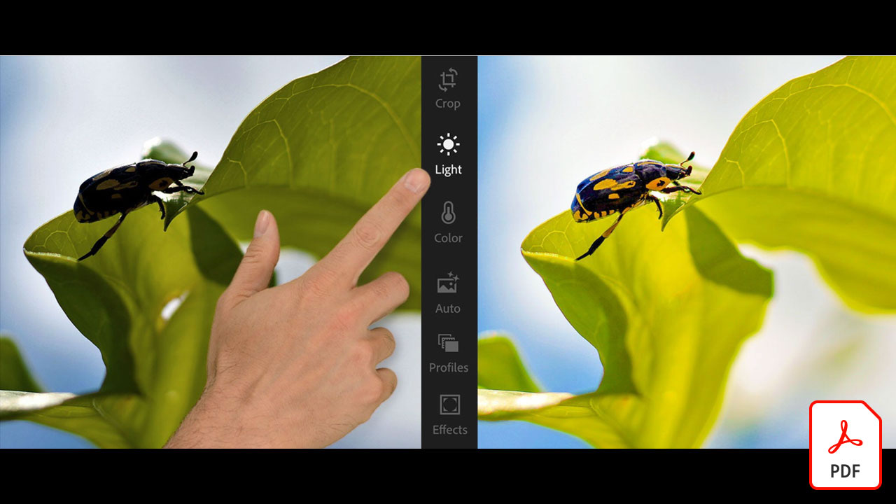

# Adobe [!DNL Stock] チュートリアル

クリエイターは、魅力的なビジュアルコンテンツを迅速に提供することが求められています。 Adobe Stockを使用すると、クリエイティブチームは毎日使用するCreative Cloudアプリ内で3億点以上ものロイヤリティフリーの画像、ビデオ、オーディオファイル、テンプレート、イラスト、3Dアセットにアクセスできます。 Creative CloudのProエディションでは、Adobe Stockの通常アセットに無制限にアクセスできます。 stock.adobe.comで最新のコレクションをご覧ください。 画像を選択して、チュートリアルを表示します。

<table>
<tr>
   <td>
      
      

      <a href="stunning-digital-assets.md"><strong>魅力的なデジタルアセット(PDF)</strong></a>
      

      <em>この実践チュートリアルでは、Adobe StockをCCライブラリと連携させ、印刷とスクリーン向けに一貫性のあるプロフェッショナルなデザイン結果を作成する方法を説明します</em>
       
  </td>
  <td>
      
      

      <a href="searchstock.md"><strong>検索Adobe [!DNL Stock] ライセンス履歴</strong></a>
      

      <em>組織のAdobeをすばやく検索する方法を説明します [!DNL Stock] エンタープライズ版Creative Cloudのライセンス履歴</em>
       
  </td>
  <td>
      
      

      <a href="handdrawn.md"><strong>Adobeに手描きの美を加える [!DNL Stock] images</strong></a>
      

      <em>Photoshop iPad版を使用して、画像に深みと奥行きを加える独自のテクニックでクリエイティブなマーケティングを強化します</em>
       
  </td>
  <td>
   
    

   <a href="flairtypography.md"><strong>マスクとアニメーションを使用してタイポグラフィに魅力を加える</strong></a>
    

    <em>Adobeの素材を使用してテキストに命を吹き込みます [!DNL Stock] After Effectsのアニメーションスタイル</em>
     
  </td>
</tr>
<tr>
  <td>
      
      

      <a href="animatevector.md"><strong>Adobeのアニメーション化 [!DNL Stock] Photoshopのベクターイラスト</strong></a>
      

      <em>Adobeのために編集可能なベクターを使用して、ニュースレターのグラフィックにアニメーションを取り込むことができます [!DNL Stock]</em>
       
  </td>
 <td>
      
      

      <a href="annualreport.md"><strong>Adobeで作成したビデオから年間レポートを開始 [!DNL Stock] およびSpark Video</strong></a>
      

      <em>Adobeを使用して年次報告書をストーリー化 [!DNL Stock] およびSpark Video</em>
       
  </td>
  <td>
      
      

      <a href="customanimations.md"><strong>Adobeごとのカスタムアニメーションでクリエイティブに命を吹き込む [!DNL Stock]</strong></a>
      

      <em>Adobeを使用 [!DNL Stock] Photoshopの画像、テクスチャ、パターン、カスタムアニメーション</em>
       
  </td>
  <td>
      
      

      <a href="changecolors.md"><strong>Adobeの変更 [!DNL Stock] ストーリーに合った画像のカラー</strong></a>
      

      <em>Adobeでユニークな写真を見つける [!DNL Stock] Adobe Photoshopでカラーを調整し、必要に応じて調整します</em>
       
  </td>
</tr>
<tr>
 <td>
      
      

      <a href="collage.md"><strong>Adobeを使用したポスターの3Dコラージュの作成 [!DNL Stock] images</strong></a>
      

      <em>Adobe Illustratorで、Adobeの画像から人目を引く3D効果を適用したコラージュをデザインしましょう [!DNL Stock]</em>
       
  </td>
  <td>
      
      

      <a href="boldlabel.md"><strong>Adobeを付けて大胆なラベルを作る [!DNL Stock] テンプレートとPhotoshopスマートオブジェクト</strong></a>
      

      <em>Adobeのリアルなパッケージテンプレートを使用して、カスタムデザインをデザインし、ビジュアル化します [!DNL Stock]</em>
       
  </td>
  <td>
      
      

      <a href="infographic.md"><strong>Adobeを使用して会社のガイドラインのインフォグラフィックを作成する [!DNL Stock]</strong></a>
      

      <em>Adobeのさまざまなアセットを組み合わせる [!DNL Stock] 視覚的に感動的なインフォグラフィックの形式でガイドラインを伝達する</em>
       
  </td>
 <td>
      
      

      <a href="featurecomparison.md"><strong>Adobeを使用して製品機能の比較表を作成する [!DNL Stock]</strong></a>
      

      <em>製品の価格プランを比較するグラフィックを作成して、見込み客に必要な情報を一目で確認できるようにします。</em>
       
  </td>
</tr>
<tr>
   <td>
      
      

      <a href="surrealcomposite.md"><strong>Adobeを使用してセミシュールな合成画像を作成する [!DNL Stock]</strong></a>
      

      <em>カラー、モーション、マスキング効果を適用した複数の画像を組み合わせて、思い出に残る編集画像を作成します</em>
       
  </td>
   <td>
      
      

      <a href="surrealpattern.md"><strong>Adobeを使用してセミシュールなパターンを作成する [!DNL Stock]</strong></a>
      

      <em>Adobeのシュールな画像に基づいて、美しいシームレスなパターンを作成します [!DNL Stock]</em>
       
  </td>
   <td>
      
      

      <a href="productconfigurator.md"><strong>Adobeを使用してインタラクティブ製品コンフィギュレーターを作成する [!DNL Stock]</strong></a>
      

      <em>インタラクティブ機能、アニメーション機能、編集可能なアートワークをAdobeから使用できます [!DNL Stock] 金融情報を目に見える形で提示する</em>
       
  </td>
  <td>
      
      

      <a href="interactivetourismphoto.md"><strong>Adobeでインタラクティブな観光写真を作成 [!DNL Stock] およびXD</strong></a>
      

      <em>Adobeを使用して、webサイトのプロトタイプ内にインタラクティブな写真をすばやく作成します [!DNL Stock] &amp; XD</em>
       
  </td>
</tr>
<tr>
 <td>
      
      

      <a href="animationemail.md"><strong>Adobeを使用した電子メール用アニメーションの作成 [!DNL Stock] およびPhotoshop</strong></a>
      

      <em>Adobeでストップアクションアニメーションを電子メールで強化 [!DNL Stock] およびPhotoshop</em>
       
  </td>
  <td>
      
      

      <a href="brandgradients.md"><strong>美しいグラデーションとAdobeで、統一感のあるブランドイメージを作成します [!DNL Stock] assets</strong></a>
      

      <em>広告キャンペーン全体でカラーとグラデーションを組み合わせ、様々な画像でブランドの一体感を生み出します</em>
       
   </td>
  <td>
      
      

      <a href="webgraphics.md"><strong>Adobeを組み合わせて魅力的なwebグラフィックを作成 [!DNL Stock] cssを使用した画像</strong></a>
      

      <em>広告キャンペーン全体でカラーとグラデーションを組み合わせ、様々な画像でブランドの一体感を生み出します</em>
       
  </td>
  <td>
      
      

      <a href="moodboard.md"><strong>Adobeですぐに刺激的なムードボードを作成できます [!DNL Stock]</strong></a>
      

      <em>プロジェクトのムード掲示板を作成して、情報、アイデア、ビジュアル、カラーパレットをチーム/クライアントに中継する</em>
       
  </td>
</tr>
<tr>
   <td>
      
      

      <a href="realisticcomposite.md"><strong>Adobeを使用したリアルな写真合成の作成 [!DNL Stock] images</strong></a>
      

      <em>2つの素晴らしいAdobeをまとめる [!DNL Stock] ソーシャル投稿にユーザーを引き込む写真</em>
       
  </td>
   <td>
   
    

   <a href="loadingscreen.md"><strong>Adobeを使用した読み込み画面のアニメーションのカスタマイズ [!DNL Stock] およびXD</strong></a>
    

    <em>Adobeからのベクターアートワークのカスタマイズ [!DNL Stock] モバイルアプリの冷たい読み込み画面のアニメーションを作成するには</em>
     
  </td>
  <td>
   
    

   <a href="presentationtemplate.md"><strong>Adobeのカスタマイズ [!DNL Stock] プロのようなデザインでありながら人目を引くプレゼンテーションテンプレート</strong></a>
    

    <em>Adobeの画像とテンプレートを使用して、美しいスタイルのプレゼンテーションを数分で作成できます [!DNL Stock] 簡単にできる特殊効果もあります</em>
     
  </td>
   <td>
   
    

   <a href="customizecolors.md"><strong>Adobeのカラーをカスタマイズする [!DNL Stock] ベクターイラスト</strong></a>
    

    <em>見栄えの良いイラストを使って、プロジェクトに磨きをかけます。 Adobeで最適なベクターを見つける [!DNL Stock]Adobe Illustratorでプロジェクトのパレットにカラーを一致させます</em>
     
  </td>
</tr>
<tr>
   <td>
      
      

      <a href="assets/AddMotiontoStillImageswithAdobeStockandPhotoshop.pdf"><strong>Adobeのある静止画へのモーションの追加 [!DNL Stock] およびPhotoshop(PDF)</strong></a>
      

      <em>静止画にビデオを組み込むことで、あらゆる画面で視聴者を驚かせることができます</em>
       
   </td>
   <td>
   
    

   <a href="assets/CreateacompositewithPhotoshopontheiPadandAdobeStockimages.pdf" target="_blank"><strong>iPadとAdobeでPhotoshopを使用して合成画像を作成する [!DNL Stock] images (PDF)</strong></a>
    

    <em>iPadでPhotoshopを活用し、お気に入りのAdobe Creative Cloudアプリケーションを全く新しい方法で使用する方法を説明します</em>
     
  </td>
   <td>
   
    

   <a href="assets/CreateaUniqueEditorialGraphicwithAfterEffectsandAdobeStock.pdf" target="_blank"><strong>Adobeのアニメーション化 [!DNL Stock] Photoshop(PDF)のベクターイラスト</strong></a>
    

    <em>After EffectsとAdobeを組み合わせる方法 [!DNL Stock]を使用すると、視覚的なストーリー性を高めるのに役立つ素晴らしい特殊効果をすばやく作成できます</em>
     
  </td>
   <td>
      
      

      <a href="assets/CreateUniqueGraphicsbyCombiningAdobeStockImages.pdf" target="_blank"><strong>Adobeを組み合わせてユニークなグラフィックを作成 [!DNL Stock] images (PDF)</strong></a>
      

      <em>2つの異なる画像を結合して、デザインプロジェクト用のまったく新しいシーンを作成します。 Adobe [!DNL Stock] Adobe Photoshopが簡単に作成できます</em>
       
   </td>
</tr>
<tr>
  <td>
      
      

      <a href="assets/CreatingaHalloweenCinemagraphwithPhotoshopCCandAdobeStock.pdf" target="_blank"><strong>Photoshop CCとAdobeでハロウィンの映画を制作 [!DNL Stock] (PDF)</strong></a>
      

      <em>Adobe Photoshopでビデオ、イラスト、写真を合成してシネマグラフを作成</em>
       
  </td>
   <td>
      
      

      <a href="assets/PutyourDatainMotionwithAdobeStockandPremierePro.pdf" target="_blank"><strong>Adobeを活用したデータの活用 [!DNL Stock] およびPremiere Pro(PDF)</strong></a>
      

      <em>Adobeを使用して、データに命を吹き込み、より説得力のあるストーリーを語ることができます [!DNL Stock] およびAdobe Premiere Pro</em>
       
  </td>
   <td>
      
      

      <a href="assets/RecolorAdobeStockVectorArtworkwithAdobeIllustratortoGetExactlytheLookYouWant.pdf" target="_blank"><strong>Adobeを再配色 [!DNL Stock] Adobe Illustratorを使用して思いどおりの外観に仕上げるベクターアートワーク(PDF)</strong></a>
      

      <em>Adobe [!DNL Stock] 独自のベクターグラフィックを簡単に見つけることができます。また、Adobe Illustratorを使用すると、クリエイティブなイメージに合わせてすばやく編集できます</em>
       
   </td>
   <td>
      
      

      <a href="assets/ShowOffyourDesignWorkintheRealWorldwithAdobeStockandPhotoshop.pdf" target="_blank"><strong>Adobeを使用して、実際にデザイン作品を披露しましょう [!DNL Stock] およびPhotoshop(PDF)</strong></a>
      

      <em>次の手順に従って、リアルなAdobeで作品を披露してください [!DNL Stock] Adobe Photoshopを使用したテンプレート</em>
       
  </td>
 </tr> 
 <tr>
   <td>
      
      

      <a href="assets/UncoveramazingdetailsinAdobeStockimageswithLightroomformobile.pdf" target="_blank"><strong>Adobeの美しいディテールを際立たせる [!DNL Stock] Lightroom for mobileの画像(PDF)</strong></a>
      

      <em>モバイルデバイスでLightroomの機能を活用して、画像を最大限に引き出しましょう</em>
       
  </td>
  <td>
      
      

      <a href="assets/VisualizePosterDesignsintheRealWorldwithAdobeStockandPhotoshop.pdf" target="_blank"><strong>Adobeで実際のポスターデザインを視覚化する [!DNL Stock] およびPhotoshop(PDF)</strong></a>
      

      <em>実際の環境でデザインを披露し、世界でどのように見えるかを把握します</em>
       
  </td>
  <td>
    
    

     
  </td>
</tr>
</table>
