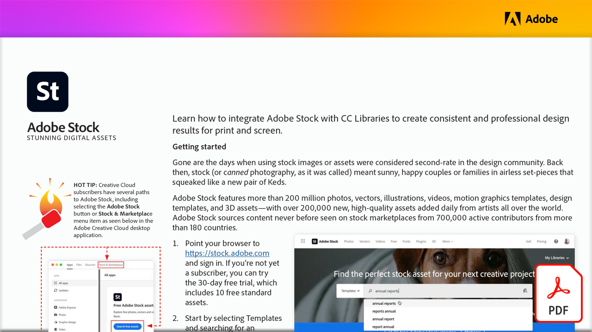

# 魅力的なデジタルアセット

この実践チュートリアルでは、Adobe StockとCC Librariesを連携させ、印刷およびスクリーン用に一貫性のあるプロフェッショナルなデザイン結果を作成する方法を説明します。

このPDFチュートリアルを表示またはダウンロードするには、以下の画像を選択してください。

[{width="680"}](assets/Stunning-Digital-Assets.pdf){target="blank"}

>[!NOTE]
>
>CC Librariesに保存されたAdobe Stockのアセットは、MicrosoftのPowerPointおよびWordにシームレスに追加できます。 Adobe Creative Cloudアドインをダウンロードしてインストールする方法は、[こちら](https://helpx.adobe.com/jp/creative-cloud/help/libraries-addin-microsoft-office.html)またはMicrosoft App Storeを参照してください。 どちらのアプリも、特にIllustrator、InDesignまたはPhotoshopでAdobe Stockの使用経験があるユーザーは、手順が簡単です。 詳しくは、[Microsoft Office 365のAdobe Stock統合プラグインの調査](https://helpx.adobe.com/jp/stock/help/microsoft-office-plug-ins.html)を参照してください。
