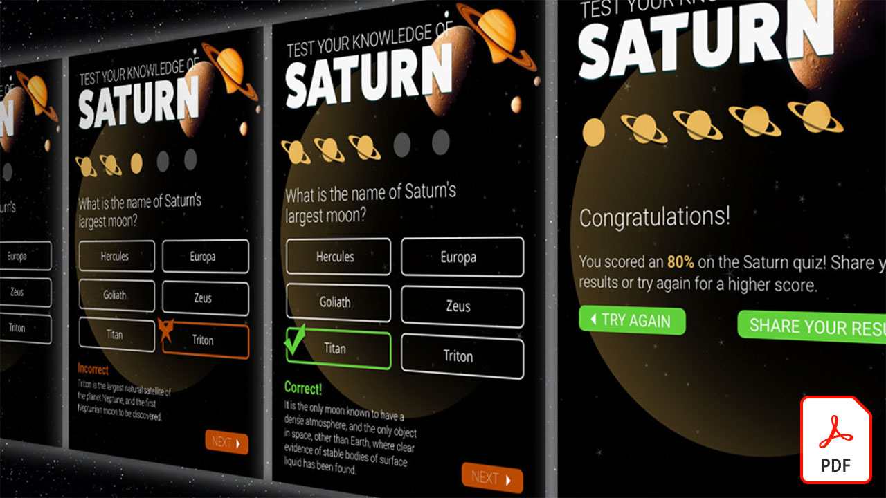

# Adobe XD tutorials

Adobe XDは、web サイト、アプリ、音声インターフェイス、ゲームなどのデジタルエクスペリエンスをデザインするための、UX デザインおよびプロトタイプ作成ツールです。 チュートリアルを表示する画像を選択します。

<table>
<tr>
 <td>
   
    

   <a href="components.md"><strong>Adobe XDの [!UICONTROL コンポーネント ] を使いこなす</strong></a>
    

    <em>[!UICONTROL コンポーネント ] を使用して、デザインワークフローにスピードと一貫性の両方を適用する、かつてない柔軟性を実現する方法を説明します</em>
     
  </td>
  <td>
   
    

   <a href="assets/ControlMultipleXDArtboardswithNestedSymbols.pdf" target="_blank"><strong>ネストされたシンボルを使用して複数のXDアートボードを制御する (PDF)</strong></a>
    

    <em>シンボルを使用すると、再利用可能なアートワークやテキストを作成して、プロジェクトのアートボード間で何度でも適用することができます</em>
     
  </td>
  <td>
   
    

   <a href="assets/CreateaZoomableeCommercePhotowithXDandAdobeStock.pdf" target="_blank"><strong>XDとAdobeでズーム可能な e コマース写真を作成 [!DNL Stock] (PDF)</strong></a>
    

    <em>高解像度の写真とAdobe XDの自動アニメーション機能を組み合わせることで、Web サイトのより魅力的なエクスペリエンスをデザインできます</em>
     
  </td>
  <td>
   
    

   <a href="assets/CreatingaRotatingProductInterfaceforECommercewithAdobeXD.pdf" target="_blank"><strong>Adobe XDを使用した E コマース用に回転する製品インターフェイスの作成 (PDF)</strong></a>
    

    <em>インターフェイスをデザインして、製品を一目で確認できます。デザインした後、web やモバイルでどのように機能するかを正確に示すインタラクティブプロトタイプを作成できます</em>
     
  </td>
</tr>
<tr>
  <td>
   
    

   <a href="assets/DesignandPrototypeanInteractiveQuizwithXD.pdf" target="_blank"><strong>XDを使用したインタラクティブクイズのデザインとプロトタイプ作成 (PDF)</strong></a>
    

    <em>プロジェクト中にユーザーに送られるフィードバックをデザインする</em>
     
  </td>
  <td>
   
    

   <a href="assets/DesignInteractiveProjectswithMicroAnimationsinXD.pdf" target="_blank"><strong>XDのマイクロアニメーションを使用したインタラクティブプロジェクトのデザイン (PDF)</strong></a>
    

    <em>Adobe XDを使用して、デザインのインタラクティブなアニメーションプロトタイプを作成する方法について説明します</em>
     
  </td>
  <td>
   
    

   <a href="assets/JumpstartyourXDProjectfromaPhotoshopFile.pdf" target="_blank"><strong>Photoshop(PSD) ファイルからのXDプロジェクトの起動 (PDF)</strong></a>
    

    <em>Adobe XDには、既存のワークフローと連動する優れたインタラクティブデザインツールが用意されており、インタラクティブデザインのビジョンを次のレベルに引き上げることができます</em>
     
  </td>
  <td>
   
    

   <a href="assets/MobileWebExperienceswithXD.pdf" target="_blank"><strong>XDを使用したモバイル Web エクスペリエンスのデザイン (PDF)</strong></a>
    

    <em>Adobe XDを使用した Russell Brown MAX Madness モバイル Web ギャラリーのデザインプロセスの舞台裏を説明します</em>
     
  </td>
</tr>
<tr>
  <td>
   
    

   <a href="assets/PrototypeaMobileWebExperiencewithAdobeXD.pdf" target="_blank"><strong>Adobe XDでのモバイル Web エクスペリエンスのプロトタイプ作成 (PDF)</strong></a>
    

    <em>エクスペリエンスデザインには、戦略、デザイン、機能的プロトタイピングが必要です。Adobe XDがあれば、これらすべてを実現できます</em>
     
  </td>
  <td>
   
    

   <a href="assets/PrototypeaMobileWebExperiencewithAdobeXD.pdf" target="_blank"><strong>外部のテキストとグラフィックを使用してXDのリピートグリッドを強化 (PDF)</strong></a>
    

    <em>リピートグリッドに外部のテキストやグラフィックを組み合わせると、生産性が飛躍的に向上します</em>
     
  </td>
  <td>
   
    

   <a href="assets/BehindtheScenesofMAXMadnesswithAdobeXD.pdf" target="_blank"><strong>『MAX・狂気とAdobe XD』(PDF)</strong></a>
    

    <em>最適化されたモバイル web エクスペリエンスは、ユーザーの心に響きます</em>
     
  </td>
  <td>
    
    

     
  </td>
</tr>
</table>
