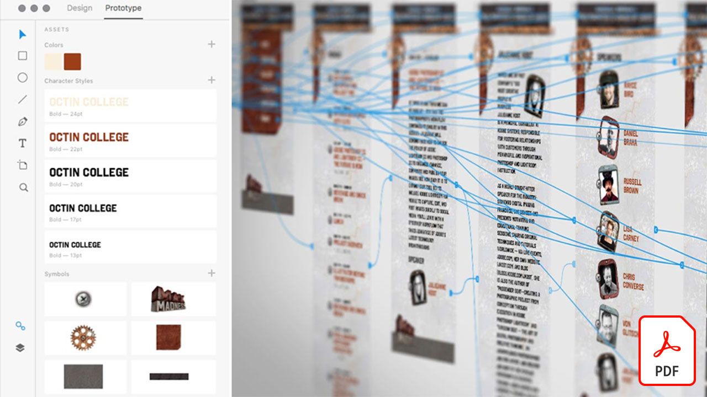

# Adobe XDチュートリアル

Adobe XDは、Webサイト、アプリ、音声インターフェイス、ゲーム、その他の種類のデジタルエクスペリエンスを設計するための、ユーザーエクスペリエンスの設計とプロトタイプ作成ツールです。

## クリックしてAdobe XDチュートリアルを表示

<table>
<tr>
 <td>
   
    

   <a href="components.md"><strong>Adobe XDの[!UICONTROL Components]を使い心地よく使う</strong></a>
    

    <em>[!UICONTROLコンポーネント]を使用して、設計ワークフローに速度と一貫性の両方を適用する際に、これまでにない柔軟性を提供する方法を説明します。</em>
     
  </td>
  <td>
   
    

   <a href="assets/ControlMultipleXDArtboardswithNestedSymbols.pdf"><strong>複数のXDアートボードをネストシンボルで制御(PDF)</strong></a>
    

    <em>シンボルを使用すると、再利用可能なアートワークやテキストを作成し、プロジェクト内のアートボードに複数回適用することができます。</em>
     
  </td>
  <td>
   
    

   <a href="assets/CreateaZoomableeCommercePhotowithXDandAdobeStock.pdf"><strong>XDおよびAdobeを使用して、ズーム可能なeコマース写真を作成する[!DNL Stock] (PDF)</strong></a>
    

    <em>高解像度の写真とAdobe XDの自動アニメーション機能を組み合わせることで、Webサイトでより魅力的な体験をデザインできます。</em>
     
  </td>
</tr>
<tr>
 <td>
   
    

   <a href="assets/CreatingaRotatingProductInterfaceforECommercewithAdobeXD.pdf"><strong>Adobe XDを使用したE-Commerce向け回転製品インターフェイスの作成(PDF)</strong></a>
    

    <em>製品の回転表示を提供するインターフェイスを設計し、Webやモバイルでの操作を正確に示す対話型のプロトタイプに設計を変更できます。</em>
     
  </td>
  <td>
   
    

   <a href="assets/DesignandPrototypeanInteractiveQuizwithXD.pdf"><strong>XDを使用した対話型クイズの設計とプロトタイプ作成(PDF)</strong></a>
    

    <em>プロジェクト中にユーザーが直面するフィードバックを設計する</em>
     
  </td>
  <td>
   
    

   <a href="assets/DesignInteractiveProjectswithMicroAnimationsinXD.pdf"><strong>XDでのマイクロアニメーションを使用したインタラクティブプロジェクトの設計(PDF)</strong></a>
    

    <em>Adobe XDを使用して、設計の対話型のアニメーションプロトタイプを作成する方法を学習します。</em>
     
  </td>
</tr>
<tr>
 <td>
   
    

   <a href="assets/JumpstartyourXDProjectfromaPhotoshopFile.pdf"><strong>Photoshop (PSD)ファイル(PDF)からXDプロジェクトをジャンプスタートする</strong></a>
    

    <em>Adobe XDは、既存のワークフローと連携して機能する、驚くべきインタラクティブなデザインツールを提供し、インタラクティブなデザインビジョンを次のレベルにまで引き上げることができます。</em>
     
  </td>
  <td>
   
    

   <a href="assets/MobileWebExperienceswithXD.pdf"><strong>XD (PDF)を使用したモバイルWebエクスペリエンスの設計</strong></a>
    

    <em>Adobe XDを使用したRussell Brown MAX MadnessモバイルWebギャラリーの設計プロセスを背景で確認する</em>
     
  </td>
  <td>
   
    

   <a href="assets/PrototypeaMobileWebExperiencewithAdobeXD.pdf"><strong>Adobe XDを使用したモバイルWebエクスペリエンスのプロトタイプ(PDF)</strong></a>
    

    <em>経験豊富な設計には戦略、設計、機能的なプロトタイプ作成が必要です。Adobe XDを使用すると、すべてを実行できます。</em>
     
  </td>
</tr>
<tr>
   <td>
   
    

   <a href="assets/PrototypeaMobileWebExperiencewithAdobeXD.pdf"><strong>XDでの繰り返しグリッドと外部テキストおよびグラフィックス(PDF)のスーパーチャージ</strong></a>
    

    <em>繰り返しグリッドを外部のテキストやグラフィックと組み合わせて、生産性を高めます。</em>
     
  </td>
  <td>
   
    

   <a href="assets/BehindtheScenesofMAXMadnesswithAdobeXD.pdf"><strong>Adobe XDでのMAX狂気の裏(PDF)</strong></a>
    

    <em>最適化されたモバイルWebエクスペリエンスを提供することで、ユーザーの共感を呼ぶことができます。</em>
     
  </td>
</tr>
</table>
